# Manage Activities in Sprinklr WFM
Activities in Sprinklr WFM include various tasks and engagements agents undertake during working hours. You can create in-office and out-of-office activities, which provide greater clarity and control in agent management. This enables more accurate scheduling by clearly indicating when agents are available for operational tasks versus when engaged in non-working or external commitments. It offers flexibility to accommodate a variety of scenarios, from planned training sessions and team meetings to urgent time off or external events, without disrupting overall productivity.

This section outlines the essential steps for managing Activities, including:

* Creating Activities
* Editing Activities
* Import Activities
* Deleting Activities
* View the Audit Log of Activities.

# Create Activities

Prerequisites for creating Activities:

* Workforce Management must be enabled for the environment.
* You must have access to the Workforce Manager Persona App.
* Create permission under the Activities section in the Workforce Management module.

Scenario: A new training program is introduced for customer service representatives. The Administrator creates a new “Training” activity to schedule and track training sessions, ensuring all representatives complete the program.

Follow these steps to create an Activity:

​

​

​

1. Go to the Workforce Manager Persona App on the Launchpad.
2. Select Settings from the Left Pane to open the Governance page.
3. Go to Activity to open the Activities Record Manager.

   ​

   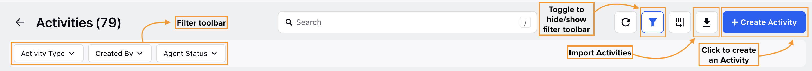

   ​
4. Click the Create Activity button at the top-right of the page to open the Create Activity page.
5. Fill in the required fields on the Create Activity page. Fields marked with a red dot are mandatory. Below are the descriptions of all the fields on this page:​

   ​

   ​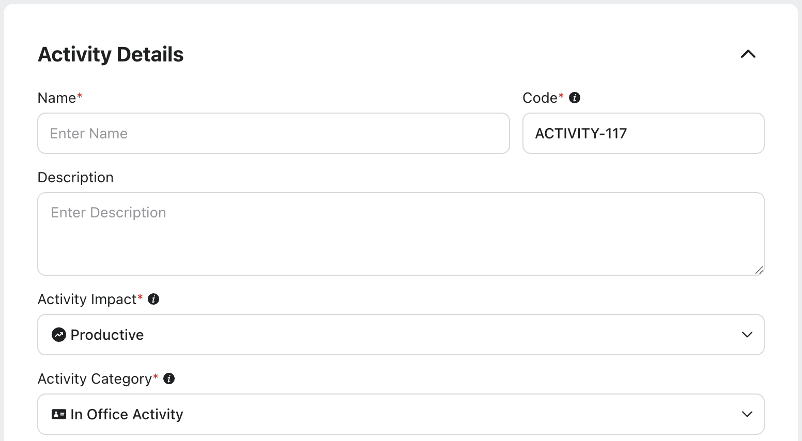

   ​

   1. Name: Enter the name of the Activity. *(Required)*
   2. Description: Briefly describe the Activity.
   3. Activity Impact: Choose whether the Activity will have an impact on the SLA calculation. *(Required)*

      1. Productive: This indicates the Activity will contribute to SLA calculations, such as overtime.
      2. Unproductive: This indicates the Activity will not impact SLA metrics, like breaks or meals.
      3. Pseudo / Not Working: This indicates the Activity is an unpaid, non-working interval. It​ is ideal for creating [Split Shifts](https://www.sprinklr.com/help/articles/manage-shifts/manage-shifts-in-sprinklr-wfm/6756dc34974a651ec2fe17c8#_7825de3c-afca-4989-a9d1-f2c3d2d9b61d "https://www.sprinklr.com/help/articles/manage-shifts/manage-shifts-in-sprinklr-wfm/6756dc34974a651ec2fe17c8#_7825de3c-afca-4989-a9d1-f2c3d2d9b61d"), that is, Shifts that include non-working intervals in between.

         Note: Selecting Pseudo / Not Working will disable the Activity Category, Include in Time Off, Activity Type, Track Adherence, and Activity Color fields.
   4. Activity Category: Choose the category of Activity. *(Required)*

      1. In Office Activity: These are tasks performed during an agent’s scheduled working hours, such as team meetings, training sessions, or quality reviews.
      2. Out of Office Activity: These are tasks or events outside working hours, including approved time off, unplanned sick leave/time offs, or unreported absence.

         Note: Selecting In Office Activity will automatically set the Activity Impact field to Productive, the Track Adherence field to Yes, and the unit of the Default Activity Duration field to Minutes. These values can be modified if needed.

         Note: Selecting Out of Office Activity will automatically set the Activity Impact field to Unproductive, the Track Adherence field to No, and the unit of the Default Activity Duration field to Hours. These values can be modified if needed.

      ​

      ​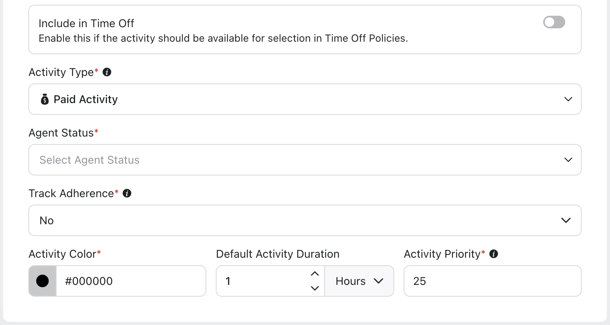

      ​
   5. Include in Time Off: Enable this switch to designate the Activity as a Time Off type. If enabled, the Activity will appear as an option when creating Time Off Policies, allowing agents to select and apply for this Activity as part of their Time Off requests.

      ​

      Note: This switch will be accessible only when Out of Office Activity is selected in the Activity Category field.

      Note: Agents can request Time Off for the Activity once the relevant Time Off Policy is successfully created and assigned.

      1. Time Off Unit: Select the unit of time (Hours or Days) agents can use when applying for Time Off related to this Activity. *(Required)*

         *​*

         Note: This field appears only when the Include in Time Off switch is enabled.
   6. Activity Type: Select the type of Activity. *(Required)*

      1. Paid Activity: This indicates that the agent will receive compensation for the Activity.
      2. Unpaid Activity: This indicates that the agent will not receive compensation for the Activity.
   7. Agent Status: Select the agent's default status during the Activity. Multiple statuses can be selected. *(Required)*
   8. Track Adherence: Specify whether the Activity should impact the agent’s Adherence. If set to No, the system will treat the agent as Neutral during this Activity, meaning it will not affect their Adherence. This can be useful for Activities like optional training or voluntary sessions. *(Required)*
   9. Activity Color: Choose a color for the Activity for easy identification while [viewing Schedules](https://www.sprinklr.com/help/articles/scheduling/manage-schedule-scenarios/6450c30ad85662201933c7cd#_074e7728-5cbe-4fea-ae1c-b0a9d760484f "https://www.sprinklr.com/help/articles/scheduling/manage-schedule-scenarios/6450c30ad85662201933c7cd#_074e7728-5cbe-4fea-ae1c-b0a9d760484f"). You can choose a color using the color picker or entering a hexadecimal code. *(Required)*
   10. Default Activity Duration: Enter the duration of the Activity, in either Minutes or Hours. This field must have a value of greater than 0. *(Required)*
   11. Default Activity Priority: Specify the priority for the Activity. The priority set here will determine which Activity is given preference if multiple Activities overlap on an agent’s schedule. You can enter any number between 1 and 100, with a lower number indicating higher priority. For example, if you assign a priority of 10 to 'Training' and a priority of 20 to 'Meeting,' 'Training' will take precedence over 'Meeting' if both activities are scheduled simultaneously. *(Required)*
   12. Show in Add Activities during scheduling: Enable this switch to make the Activity available in the Add Activities section while viewing Schedule Scenarios. *This switch is enabled by default. (Required)*

       *​*

       Share Settings

       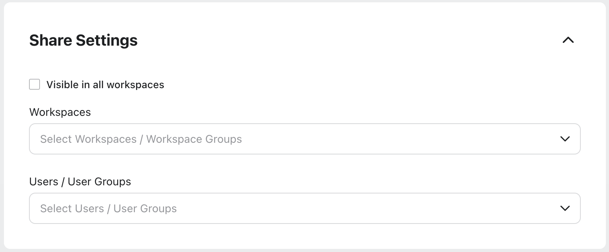

       ​
   13. Visible in all workspaces*:* Select this checkbox to share the Activity with all available Workspaces.
   14. Workspaces: Select the Workspaces that you want to share the Activity with. *This field will be accessible only if the* *Visible to all workspaces* *checkbox is not selected.*
   15. User/User Groups: Select the User(s)/User Group(s) you want to share the Activity with. *This field will be accessible only if the* *Visible to all workspaces* *checkbox is not selected.*

       *​**​*

       Note: You will not see an Activity in the Activity Catalog, either in the Schedule Scenario view or on the Shift creation page, unless it has been shared with them.
6. Click the Save button at the bottom right of the page to create the Activity.

This completes the process of creating an Activity.

---

# Edit Activities

Prerequisites for editing Activities:

* Workforce Management must be enabled for the environment.
* You must have access to the Workforce Manager Persona App.
* Edit permission under the Activities section in the Workforce Management module.

Scenario: The duration of lunch breaks needs to be adjusted due to a change in company policy. The Administrator edits the existing “Lunch Break” activity to extend the duration from 30 minutes to 45 minutes, ensuring compliance with the new policy.

Follow these steps to edit an Activity:

1. Go to the Workforce Manager Persona App on the Launchpad.
2. Select Settings from the Left Pane to open the Governance page.
3. Go to Shift Activity to open the Activities Record Manager.

   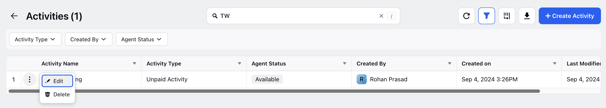
4. Hover over the vertical ellipsis (⋮) icon corresponding to the Activity you want to edit. This will show a list of options.
5. Select Edit from the list of options to open the Edit Activity page.
6. Update the necessary details for the selected Activity. The fields are the same as those used when creating an Activity.

   Note: The Activity Category field cannot be modified.
7. After entering the updated details, click the Save button at the bottom right of the Edit Activities page to save the Activity.

This completes the process of editing an Activity.

---

# Bulk Import Activities

Follow these steps to bulk import Activities:

1. [Navigate](#8c6c1366-a024-468b-89ca-d2b27da10495 "#8c6c1366-a024-468b-89ca-d2b27da10495") to Activities Record Manager.

   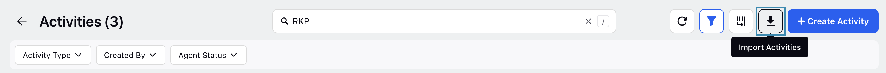
2. Click the Import Activities button at the top right of the page to open the Import Activities window.

   ​

   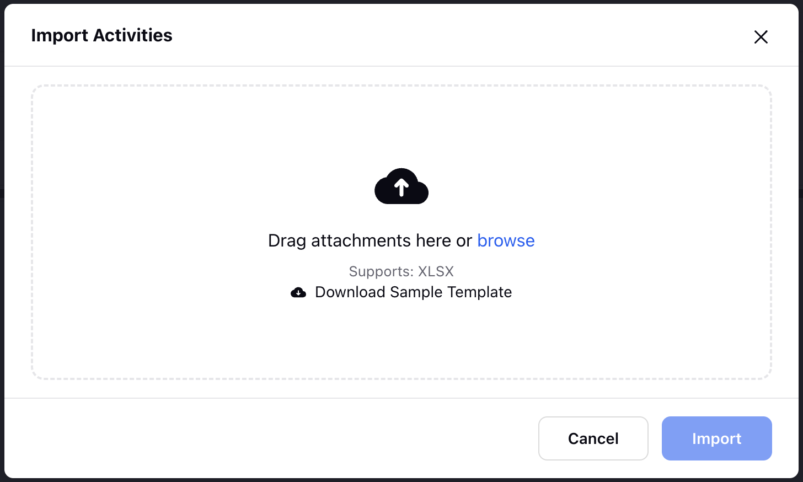

   ​
3. Upload the template file with details of the Activities. *The template file must be in* *.xlsx* *format.*
4. Once the file is successfully uploaded, click the Import button.

After clicking the Import button, it will take some time to complete the import process. You will receive a toast notification if the import was successfully completed.

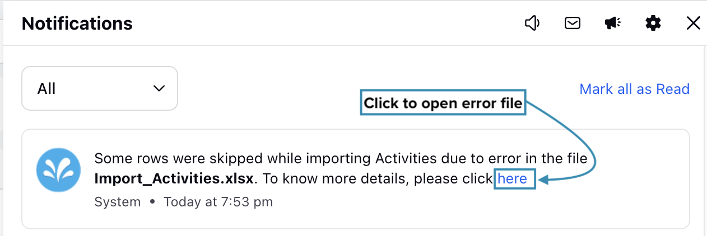

You will receive a system notification if the import cannot be completed due to an error in the file. The notification will include a link. Clicking the link will open a file that displays the errors in the uploaded template.

The Position column in the file will show the cell numbers where errors were detected, and the corresponding cells in the Error column will contain the error descriptions.

## Activity Import File Specifications

* XLSX is the approved file format.
* The Activity Code must be unique for each Activity. It cannot be identical to any other Activity in the import file or any existing Activity in your environment.
* Unless specified otherwise, all text-based headers are case-insensitive.

The following headers are mandatory in the template file (Do not modify the header, including their case):

|  |  |  |
| --- | --- | --- |
| Parameter | Header | Remarks |
| Activity Name | Name | Mandatory header. |
| Activity Code | activityCode | Optional header. Must be alphanumeric. If not provided, Activity Code will be auto generated. |
| Activity Description | description | Optional header. |
| Activity Category | activityCategory | Mandatory header. (In Office or Out Of Office). |
| Time Off Unit | timeOffUnit | Optional header. (Days or Hours).  Note: This header is mandatory if the activityCategory header is set to Out Of Office. |
| Activity Type | type | Mandatory header. (Paid or Unpaid) |
| Activity Impact | activityImpact | Mandatory header. (Productive, Unproductive, or Not Working). |
| Default Agent Status for the Activity | agentStatus | Mandatory header. The status must already exist in your system and must exactly match the existing status. You can specify multiple statuses by separating them with commas. |
| Track Adherence | trackAdherence | Mandatory header. (Yes or No). |
| Activity Color | activityColor | Mandatory header. Enter the hexadecimal code of the Activity color. (For example, #54BEEE) |
| Default Activity Duration | defaultActivityDuration | Optional integer header. |
| Default Activity Duration Unit | defaultActivityDurationUnit | Optional text header. (Hours or Minutes)  Note: This header is mandatory if the defaultActivityDuration is populated. |
| Default Activity Priority | defaultActivityPriority | Mandatory integer header. |
| Activity’s Availability in Schedule Scenario Activity Catalogue | viewInActivityCatalogue | Mandatory header. (True or False).  Note: This header must be set to False for Activities with the activityCategory header set to Out of Office. |
| Visible in All Workspaces | visibleInAllWorkspaces | Optional header. |
| Shared Workspaces | sharedWorkspaces | Optional header. |
| Shared Workspace Groups | sharedWorkspaceGroups | Optional header. |
| Shared Users | sharedUsers | Optional header. |
| Shared User Groups | sharedUserGroups | Optional header. |

This completes the process of bulk importing Activities.

---

# Delete Activities

Prerequisites for deleting Activities:

* Workforce Management must be enabled for the environment.
* You must have access to the Workforce Manager Persona App.
* Delete permission under the Activities section in the Workforce Management module.

Scenario: A training program for new customer service representatives has concluded. The Administrator deletes the “New Hire Training” activity to streamline the schedule and ensure that only current and relevant activities are displayed.

Follow these steps to delete an Activity:

1. Go to the Workforce Manager Persona App on the Launchpad.
2. Select Settings from the Left Pane to open the Governance page.
3. Go to Shift Activity to open the Activities Record Manager.

   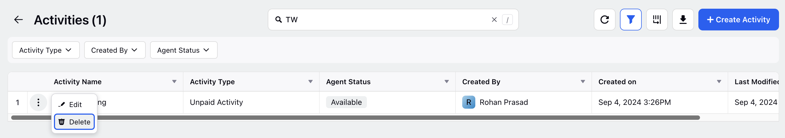
4. Hover over the vertical ellipsis (⋮) icon corresponding to the Activity you want to delete. This will show a list of options.
5. Select Delete from the list of options to open the Delete Activity dialog box.

   ​

   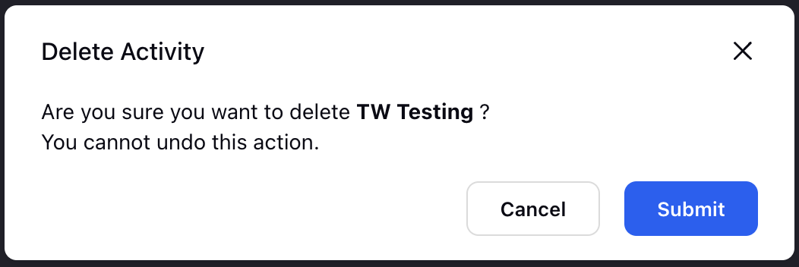
6. Select Submit to delete the Activity. *This action cannot be undone.*

This completes the process of deleting an Activity.

---

# View Audit Log of Activities

Audit log of Activities allows you to track all changes made to Activities. It stores a comprehensive history of every change, including date and time stamps, along with details of the user who made the changes. This ensures full transparency and traceability, enabling managers to review and verify activities, maintain accountability.

Prerequisites for viewing audit log of Activities: 

* Workforce Management should be enabled for the environment.
* You must have access to the Workforce Manager Persona App.
* View permission under the Activities section in the Workforce Management module.

Follow these steps to view the audit log of Activities:

1. Go to the Workforce Manager Persona App on the Launchpad.
2. Select Settings from the Left Pane to open the Governance page.
3. Go to Shift Activity to open the Activities Record Manager.
4. Hover over the vertical ellipsis (⋮) icon corresponding to the Activity for which you want to view the audit log. This will show a list of options.
5. Select View Audit Logs from the list of options to open the Activity window from the Third Pane.

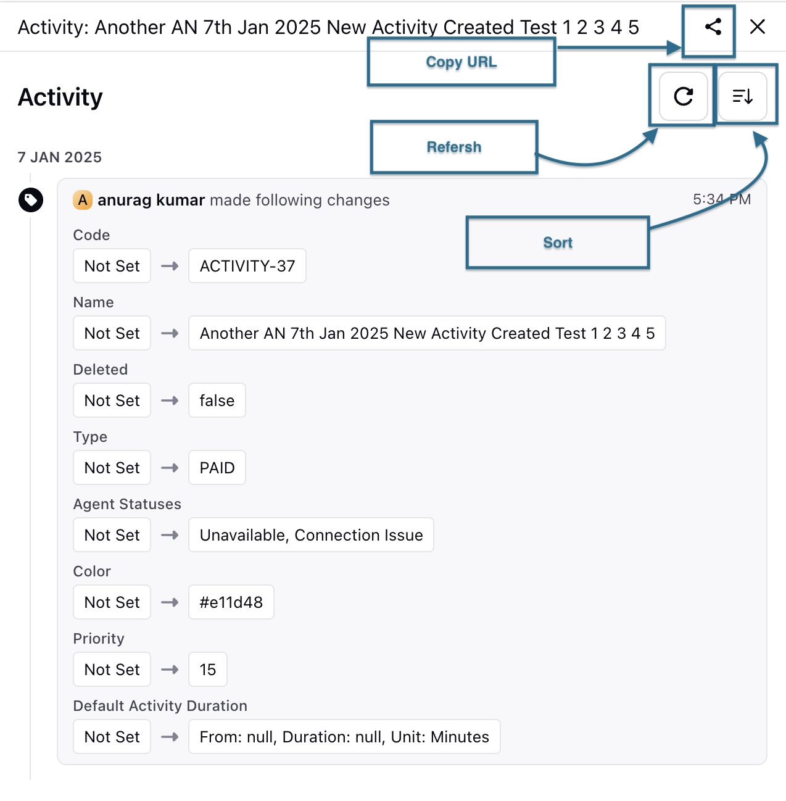

You can view all the changes made to the Activity from the Third Pane. You can refresh the data, sort it by the date of updates in ascending or descending order, and copy the URL of the Activity for easy sharing.