# Manage Presets

Presets are predefined configurations of staffing metrics, such as shrinkage, concurrency, and average handling time. Presets can be defined for individual channels, such as voice calls, live chat, and video chat. They can be specified as a fixed value or configured based on the day of the week and time of day.

This section outlines the essential steps for managing Presets, including:

* Creating Presets
* Enable/disable Presets
* Editing Presets
* Cloning Presets
* Sharing Presets
* Deleting Presets.

# Create Presets

Prerequisites for creating Presets:

* Sprinklr WFM should be enabled for the environment.
* You must have access to the Workforce Manager Persona App.
* Create permission under the Staffing Preset section in the Workforce Management module.

Follow these steps to create a Preset:

​

1. Go to the Workforce Manager Persona App on the Launchpad.
2. Select Settings from the Left Pane to open the Governance page.
3. Select Staffing Presets to open the Presets record manager.

   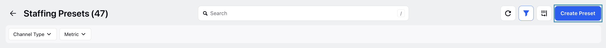
4. Click the Create Preset button at the top right corner of the record manager to open the page to create Preset.
5. Fill in the required fields on the page. Fields marked with a red dot are mandatory. Below are the descriptions of the fields on this page:

   ​

   ​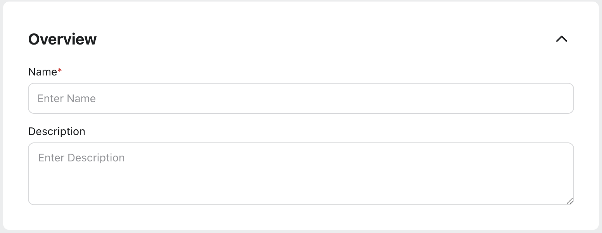

   ​

   1. Name: Enter the name of the Preset. *(Required)*
   2. Description: Briefly describe the Preset.

      Share Settings​

      ​

      ​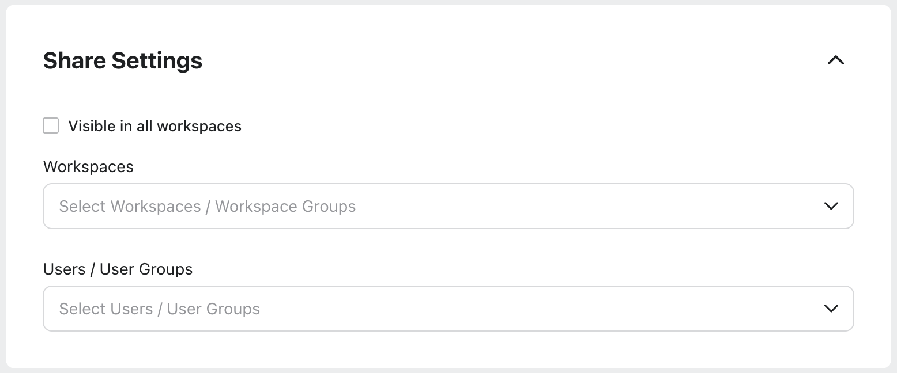

      ​
   3. Visible in all workspaces: Select this checkbox if you want Preset to be visible in all available Workspaces.
   4. Workspaces: Select the Workspace(s) in which you want the Preset to be visible. *This field is accessible only if the* *Visible in all workspaces* *field is not selected.*
   5. User/User Groups: Select the User(s)/User Group(s) you want to share the Preset with. *This field is accessible only if the* *Visible in all workspaces* *field is not selected.*
6. Click the Next button at the bottom right of the page to open the Preset Details page.

   ​

   ​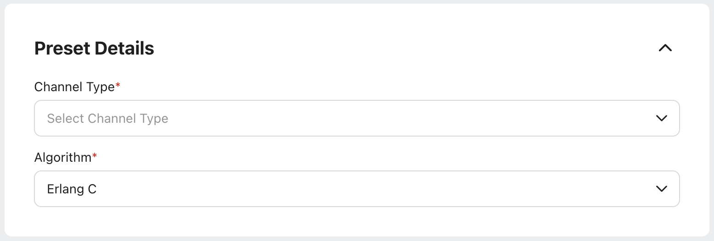

   ​

   1. Channel Type: Select the channel for which you want to create the Preset. *(Required)*
   2. Algorithm: Select the algorithm to calculate the required full-time equivalents (FTEs). Available options are Erlang C and Unitary. *(Required)*

      Note: The selected algorithm will be used in the mapped Work Types.

      Based on your selections in the Channel Type and Algorithm fields, the corresponding Presets can be configured on this page. The table below outlines the available combinations.

      |  |  |  |
      | --- | --- | --- |
      | Channel Type | Algorithm | Configurable Presets |
      | Voice Call, Preview Voice Call, Voice Post Call | Erlang C | Average Handle Time, Minimum Service Level, In-Office Shrinkage, Out-of-Office Shrinkage, Maximum Occupancy |
      | Voice Call, Preview Voice Call, Voice Post Call | Unitary | Average Handle Time, In-Office Shrinkage, Out-of-Office Shrinkage, Maximum Occupancy |
      | Non-Voice Channels (Email, Live Chat, and more) | Erlang C | Concurrency, Average Handle Time, Minimum Service Level, In-Office Shrinkage, Out-of-Office Shrinkage, Maximum Occupancy |
      | Non-Voice Channels (Email, Live Chat, and more) | Unitary | Concurrency, Average Handle Time, In-Office Shrinkage, Out-of-Office Shrinkage, Maximum Occupancy |
7. Enter the value for each staffing preset on this page. The values can be specified as constant value or for day of the week and time of day.

   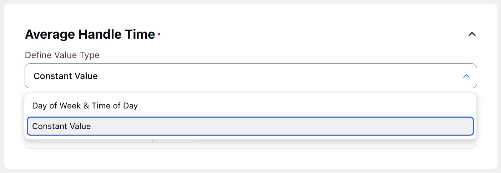

   1. Day of Week & Time of Day: The Day of Week & Time of Day option allows you to set different values depending on the day and time of the week. *Refer to the* [*Select Multiple Metric Values*](#_6ae2f0f9-ba0f-48d4-a1d7-abe71b04ade2 "#_6ae2f0f9-ba0f-48d4-a1d7-abe71b04ade2") *section below for more details on how to select multiple metric values.*
   2. Constant Value: This Constant Value option allows you to set a single value that always applies uniformly.

      Note: It is mandatory to configure the Average Handle Time and Minimum Service Level sections to create Presets.
8. Click the Create button at the bottom right of the page to save the details and create the Preset.

## Select Multiple Metric Values

If you have selected the Day of Week & Time of Day option while adding details for the metrics, you can add multiple values for the same metric.

Follow these steps to add additional metric values and choose the interval:

​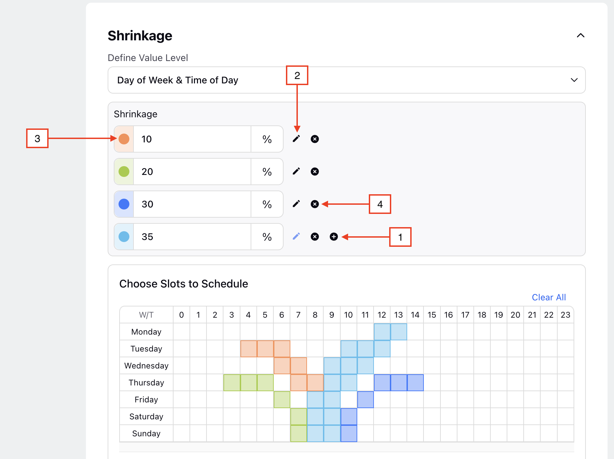

1. Click the Add (+) button to add a new metric value.
2. Click the Edit button to select the metric value, then click on the selected slot(s) to add this value.
3. Click the Color Selection button to change the color coding of the selected metric value.
4. Click the Remove (x) button to delete a metric value. Deleting metric values will also remove them from the selected intervals.

   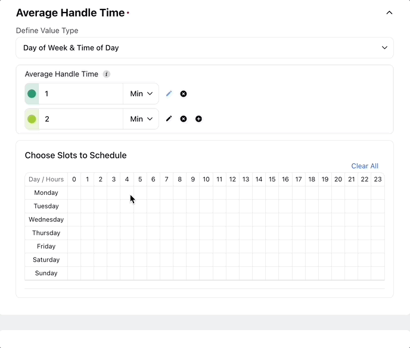

Note: After selecting all the desired time intervals for a particular value, click the Edit button of the next value and repeat the process of selecting the slots for that value.

Note: All the intervals must be filled to create the Preset.

# ​​Configurable Metrics

## Average Handling Time​

​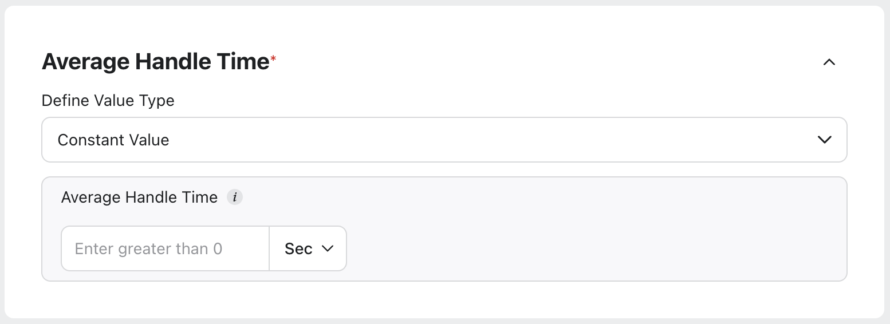

​

Average Handling Time (AHT) represents the average duration it takes for an agent to handle a customer interaction from start to finish. It includes time spent talking to the customer and any additional tasks required after the call ends. AHT can be configured in seconds, minutes, or hours with up to 2 decimal points (for example, 2.15 minutes, 0.15 hours).

## Concurrency

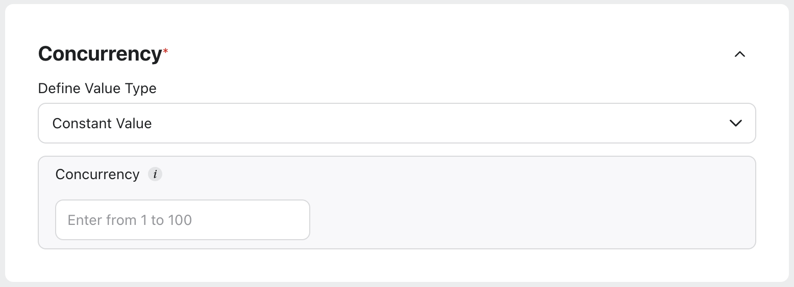

Concurrency is the ability to manage and process multiple tasks or operations simultaneously without conflict or delay. It is specified as an integer between 0 and 100.

## Minimum Service Level

​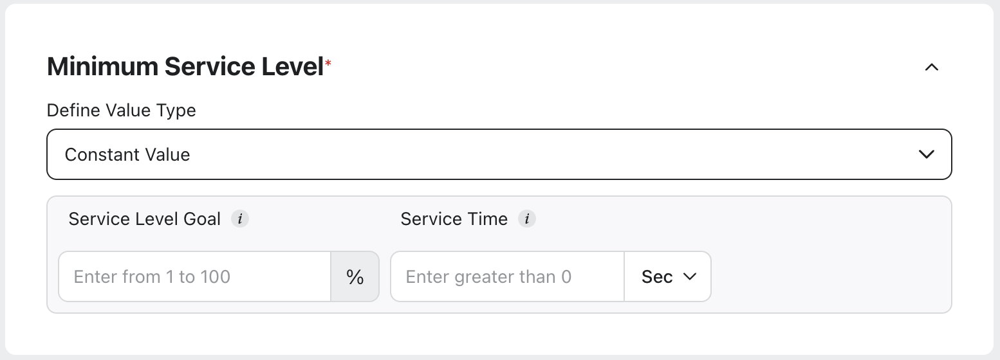

​

Minimum Service Level refers to the lowest acceptable standard of service performance that must be maintained to meet customer expectations and contractual obligations. The Service Level Goal sets the target percentage of all interactions that should be addressed within a specified time frame, known as the Service Time. Service Time can be configured in seconds, minutes, or hours with up to 2 decimal points (for example, 2.15 minutes, 0.15 hours).

## In Office Shrinkage

​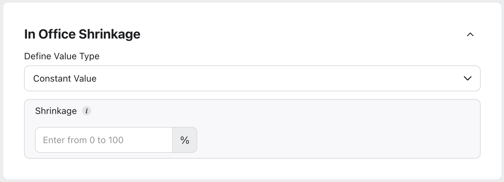

​

In Office Shrinkage refers to the reduction in available workforce due to events that occur within the office, such as meetings, training sessions, or breaks. It is a percentage value and can have up to two decimal points (for instance, 9.85% and 12.5%).

## Out of Office Shrinkage

​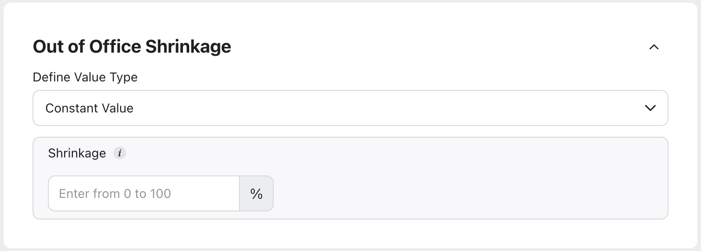

​

Out of Office Shrinkage refers to a reduced available workforce due to activities or events outside the workplace, such as vacations, sick leave, or personal time off. It is a percentage value with up to two decimal points (for instance, 9.85% and 12.5%).

## Maximum Occupancy

​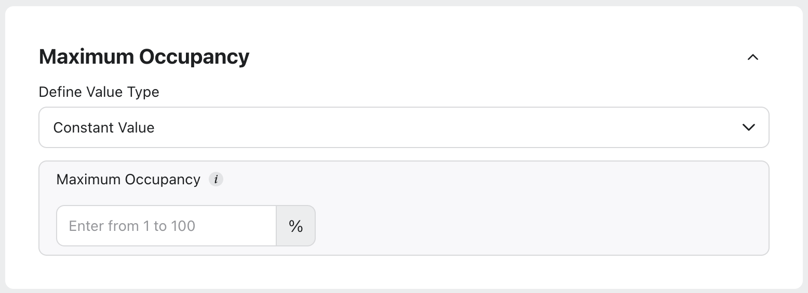

​

Maximum Occupancy is expressed as a percentage, indicating how many agents are available to handle interactions, considering both their productive and non-productive time. It is a percentage value with up to two decimal points (for instance, 75.1% and 12.5%).

|  |  |  |
| --- | --- | --- |
| Parameter | Value Type | Remarks |
| Average Handling Time | Numeric Value | It can be configured in seconds, minutes, or hours, with up to two decimal points. The minimum value must be more than 0 seconds, and the maximum value can be 720 hours, even if the unit is minutes or seconds, converted accordingly. |
| Minimum Service Level | Service Level Goal: Percentage | Service Level Goal: It must be greater than 0 and less than 100 with up to two decimal points. |
| Service Time: Numeric Value | Service Time: It can be configured in seconds, minutes, or hours, with up to two decimal points. The minimum value must be more than 0 seconds, and the maximum value can be 480 hours, even if the unit is minutes or seconds, converted accordingly. |
| In Office Shrinkage | Percentage | It must be greater than 0 and less than 100 with up to two decimal points. |
| Out of Office Shrinkage | Percentage | It must be greater than 0 and less than 100 with up to two decimal points. |
| Maximum Occupancy | Percentage | It must be greater than 0 and less than 100 with up to two decimal points. |
| Concurrency | Numeric Value | It must be an integer between 0 and 100, both inclusive. |

---

# Enable/Disable Presets

Follow these steps to enable or disable a Preset:

1. Navigate to the Staffing Presets record manager.

   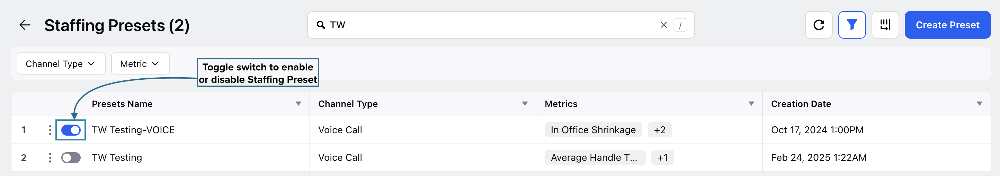
2. Click the toggle switch in the Preset Names column to enable or disable the Preset.

This completes the process of enabling or disabling Presets.

---

# Edit Presets

Prerequisites for editing Presets:

* Sprinklr WFM should be enabled for the environment.
* You must have access to the Workforce Manager Persona App.
* Edit permission under the Staffing Preset section in the Workforce Management module.

Follow these steps to edit a Preset:

1. [Navigate](#2b49abb5-bca7-4e2f-b93b-2da1f80d2b88 "#2b49abb5-bca7-4e2f-b93b-2da1f80d2b88") to the Presets record manager.

   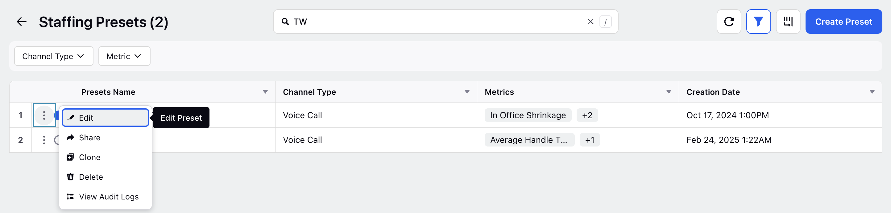
2. Hover over the vertical ellipsis (⋮) icon corresponding to the Preset you want to edit. This will show a list of options.
3. Select Edit from the list of options.
4. Update the necessary details for the selected Preset. The fields are the same as those used when creating a Preset.
5. After entering the updated details, click the Save button at the bottom right of the page to save the Preset with new details.

This completes the process of editing Presets.

---

# Share Presets

Prerequisites for sharing Presets:

* Sprinklr WFM should be enabled for the environment.
* You must have access to the Workforce Manager Persona App.
* Share permission under the Staffing Preset section in the Workforce Management module.

Follow these steps to share a Preset:

1. [Navigate](#2b49abb5-bca7-4e2f-b93b-2da1f80d2b88 "#2b49abb5-bca7-4e2f-b93b-2da1f80d2b88") to the Presets record manager.

   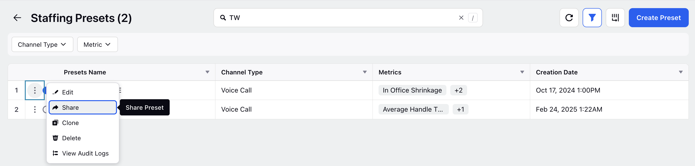
2. Hover over the vertical ellipsis (⋮) icon corresponding to the Preset you want to share. This will show a list of options.
3. Select Share from the list of options to open the Share With dialog box.
4. Fill in the required fields in the Share With dialog box. Below are the descriptions of the fields on this dialog box:

   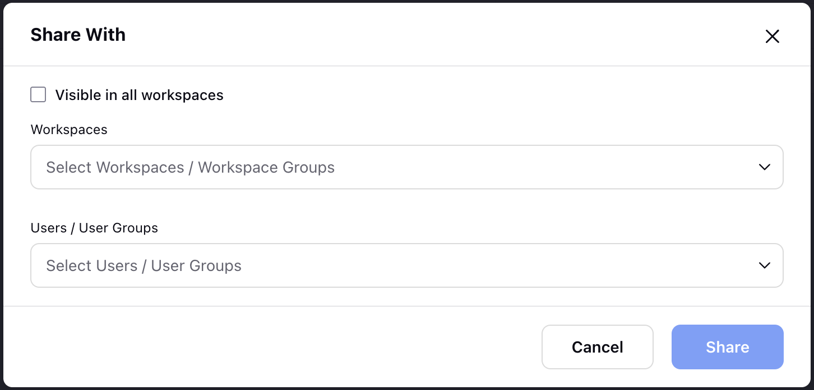

   1. Visible to all users: Select this checkbox to share the Preset with all available Users.
   2. Workspaces: Select the Workspace(s) with which you want to share the Preset. *This field will be accessible only if the* *Visible in all users* *checkbox is not selected.*
   3. Users/User Groups: Select the User(s)/User Group(s) with whom you want to share the Preset. *This field will be accessible only if the* *Visible to all users* *checkbox is not selected.*
5. Click the Share button in the dialog box. This will share the Preset with the selected Workspace(s) and User(s)/User Group(s).

This completes the process of sharing Presets.

---

# Clone Presets

Prerequisites for cloning Presets:

* Sprinklr WFM should be enabled for the environment.
* You must have access to the Workforce Manager Persona App.
* Clone permission under the Staffing Preset section in the Workforce Management module.

Follow these steps to clone a Preset:

1. [Navigate](#2b49abb5-bca7-4e2f-b93b-2da1f80d2b88 "#2b49abb5-bca7-4e2f-b93b-2da1f80d2b88") to the Presets record manager.

   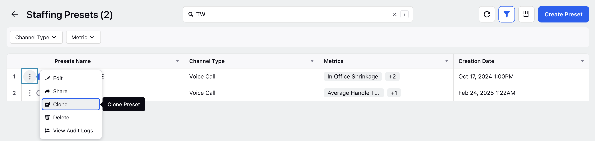
2. Hover over the vertical ellipsis (⋮) icon corresponding to the Preset you want to clone. This will show a list of options.
3. Select Clone from the list of options to open the Clone Staffing Preset dialog box.

   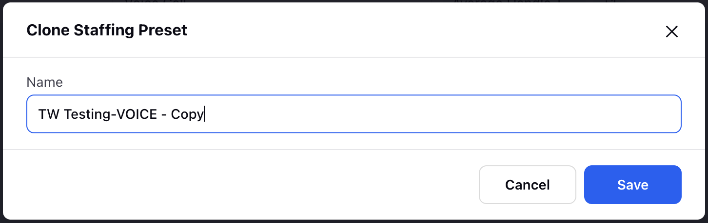
4. Enter the name of the cloned Preset in the Name field. By default, the name of the cloned Preset will be “\<Name of original Preset\> - Copy”.
5. Click the Save button at the bottom right of the dialog box to create a cloned version of the Preset.

This completes the process of cloning Presets.

---

# Audit Trail for Presets

Follow these steps to view the audit log of a Preset:

1. [Navigate](#2b49abb5-bca7-4e2f-b93b-2da1f80d2b88 "#2b49abb5-bca7-4e2f-b93b-2da1f80d2b88") to the Presets record manager.

   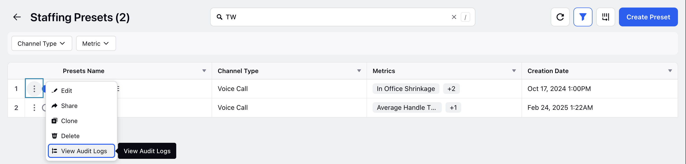
2. Hover over the vertical ellipsis (⋮) icon corresponding to the Preset for which you want to view the audit log. This will show a list of options.
3. Select View Audit Logs from the list of options to open the Activity window from the Third Pane.

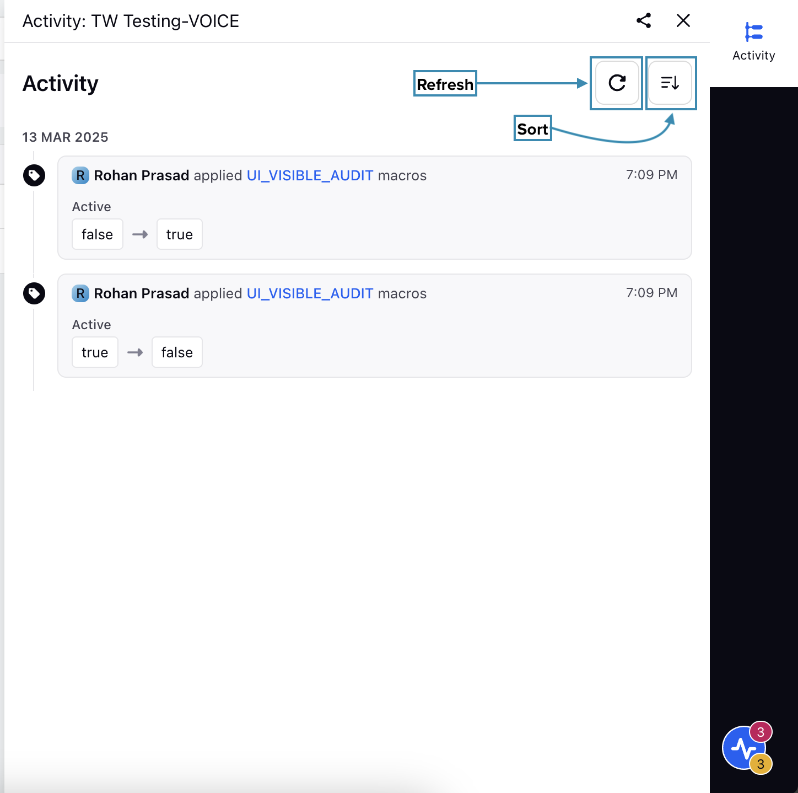

From the Third Pane, you can view all the changes made to the Preset. You can refresh the data and sort it by the date of updates in ascending or descending order.

---

# Delete Presets

Prerequisites for deleting Presets:

* Sprinklr WFM should be enabled for the environment.
* You must have access to the Workforce Manager Persona App.
* Delete permission under the Staffing Preset section in the Workforce Management module.

Follow these steps to delete a Preset:

1. [Navigate](#2b49abb5-bca7-4e2f-b93b-2da1f80d2b88 "#2b49abb5-bca7-4e2f-b93b-2da1f80d2b88") to the Presets record manager.

   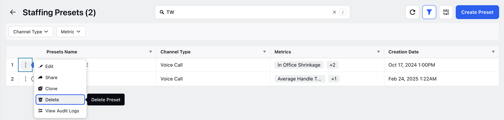
2. Hover over the vertical ellipsis (⋮) icon corresponding to the Preset you want to delete. This will show a list of options.
3. Select Delete from the list of options to open the Delete Preset dialog box.

   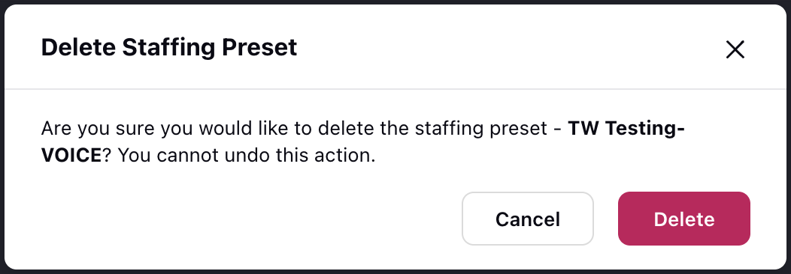
4. Select Delete to delete the Preset. *This action cannot be undone.*

This completes the process of deleting a Preset.

---