# Manage Shift Bidding

Shift Bidding helps you balance staffing requirements while giving agents greater control over their work schedules. With Sprinklr’s Shift Bidding, Workforce Managers can automatically generate shift patterns that align with forecasted volume, average handle time (AHT), and assigned Schedule Policies. Agents bid on these shifts based on their availability, while the system uses configurable Ranking Metrics to fairly resolve conflicts and allocate shifts once the bidding period ends. This approach creates optimized, policy‑compliant schedules that maintain Work Type balance and evenly distribute understaffing or overstaffing across all intervals, improving both operational efficiency and employee satisfaction.

# Navigate to Shift Bidding Record Manager

Follow these steps to navigate to the Shift Bidding record manager:

​

​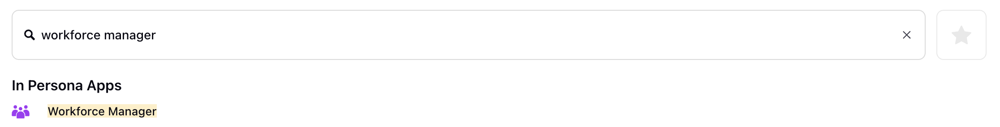

​

1. Go to the Workforce Manager Persona App on the Launchpad.
2. Select Settings from the Left Pane to open the Governance page.

   ​

   ​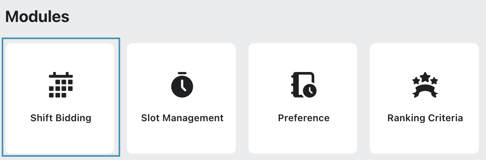

   ​
3. Select Shift Bidding to open the Shift Bidding record manager.

# Create Shift Bid

Prerequisites for creating Shift Bids:

* Workforce Management should be enabled for the environment.
* You must have access to the Workforce Manager Persona App.
* View and Create permissions under the Shift Bidding section in the Workforce Management module.

Follow these steps to create a Shift Bid:

1. Navigate to the Shift Bidding record manager.
2. Click the “+Create Bid” button at the top right to open the Create Shift Bid page.
3. Fill in the required fields on the Create Shift Bid page. Fields marked with a red star are mandatory. Below are the descriptions of the fields on this page:

   ​

   ​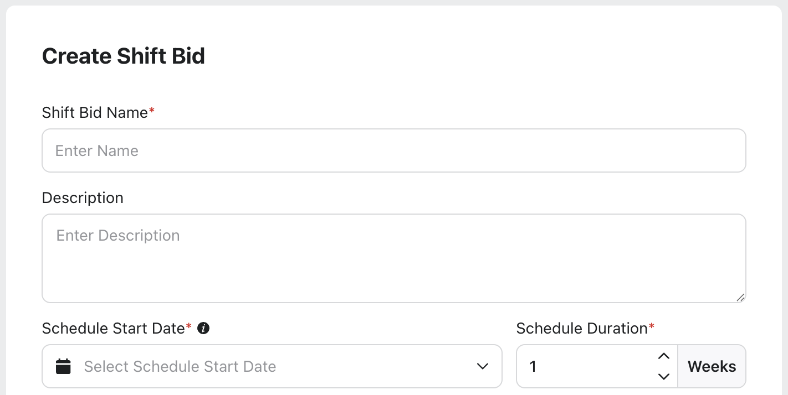

   ​

   1. Shift Bid Name: Enter a unique and descriptive name for the Shift Bid. *(Required)*
   2. Description: Provide additional details about the Shift Bid, such as the purpose, target users, or any special instructions.
   3. Schedule Start Date: Select the date on which the schedule generated from this Shift Bid will begin.

      All assigned shifts are calculated starting from this date. *(Required)*
   4. Schedule Duration: Specify the number of weeks for which the schedule will be generated, starting from the Schedule Start Date. *It must be a whole number.* *(Required)*

      Note: The system calculates the actual schedule duration by adding the Schedule Duration to the Schedule Start Date.

      *​*

      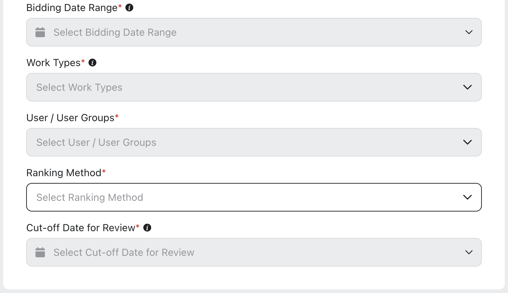

      *​*
   5. Bidding Date Range: Select the start and end dates during which agents can submit their preferences. Agents cannot submit preferences outside this date range. *(Required)*

      Note: The Bidding Date Range can start on the date the bid is created and can extend up to two days before the Schedule Start Date.

      For example, if the Schedule Start Date is April 10, the Bidding Date Range can begin on the creation date and cannot end later than April 8.
   6. Work Types: Select one or more Work Types to include in the Shift Bid. This selection determines which agents are eligible for the Shift Bid. Only the Users and User Groups associated with the selected Work Types are available for selection in the User / User Groups field below. *(Required)*

      Note: Only Work Types with published data in the Master Forecast for the selected schedule duration are available for selection.
   7. User / User Groups: Select the users or user groups that can participate in this Shift Bid. After you select the Work Types, all associated users and user groups are displayed automatically. You can add only users who belong to the selected Work Types. *(Required)*
   8. Ranking Method: Choose the Ranking Method used to prioritize bids when assigning shifts. The ranking method determines how conflicts are resolved when multiple users bid for the same shift. *(Required)*
   9. Cut-off Date for Review: Select the last date on which bids can be reviewed or modified before final assignment. *(Required)*

      Note: The Cut‑Off Date for Review can be set to one day after the end of the Bidding Date Range and must not be later than the Schedule Start Date. For example, if the Bidding Date Range ends on April 8 and the Schedule Start Date is April 12, the Cut‑Off Date for Review can be set between April 9 and April 12.
4. Click the "+Reminder" under the Reminder to Agents section tonotify agents before Shift Bid submission deadlines. You can choose whether to set reminders for the Shift Bid and configure multiple reminders if needed.

   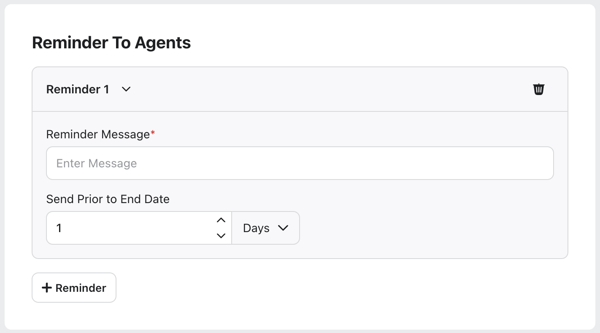

   1. Reminder Message: Enter the message that will be sent to agents as a reminder. Use this message to prompt agents to submit or review their bids before the bidding period ends. *(Required)*
   2. Send Prior to End Date: Specify how far in advance, either in Days or hours, the reminder message is sent before the end of the Bidding Date Range. This setting determines when agents receive the reminder relative to the bidding end date.
5. Click the Next button to open the Shift Patterns page. The Shift Bidding Type is set to Automatic and Policy Validation set to Work Contract, Assignment, and Day Off. These details cannot be modified.

   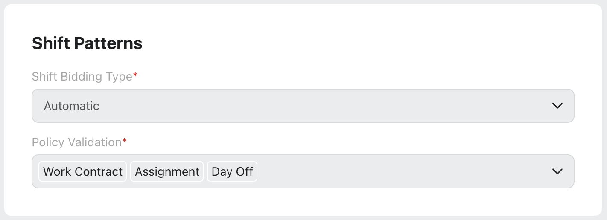
6. Click the Next button to open the Share Setting page. On this page, you configure which users can view the Shift Bid configuration. Note that sharing determines visibility of the configuration only and does not grant agents permission to participate in the Shift Bid.
7. Fill in the required fields on the Share Setting page. Below are the descriptions of the fields on this page:

   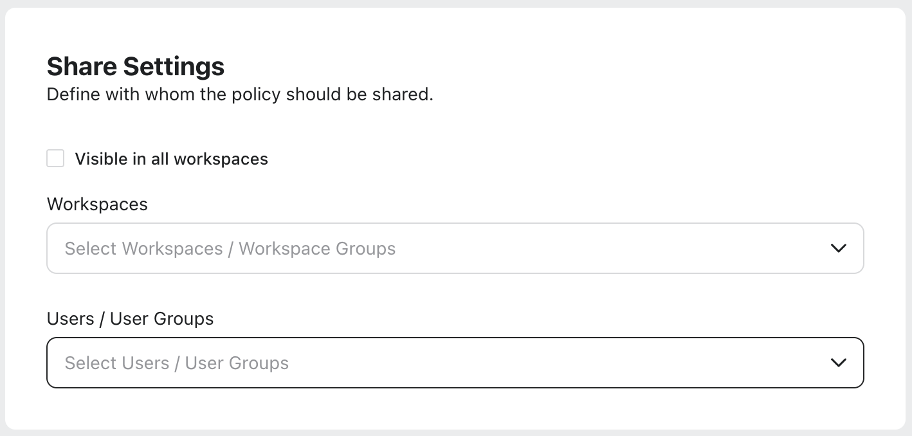

   1. Visible in all workspaces: Select this checkbox to share the Shift Bid with all available Workspaces.
   2. Workspaces: Select the Workspace(s) that you want to share the Shift Bid with. *This field will be accessible only if the* *Visible to all workspaces* *checkbox is not selected.*
   3. Users / User Groups: Select the User(s)/User Group(s) you want to share the Shift Bid with. *This field will be accessible only if the* *Visible to all workspaces* *checkbox is not selected.*
8. Click the Create button to create the Shift Bid.

Once the Shift Bid is created, the Shift Bid will go into the Processing state. Once the processing is complete, the Shift Bid goes into a Draft state and becomes ready to view.

# View Shift Bidding Details

After you successfully create a Shift Bid and it moves to the Draft state, you can open it to track the Shift Bid details.

Follow these steps to view the Shift Bid details:

1. Navigate to the Shift Bidding record manager.

   ​

   ​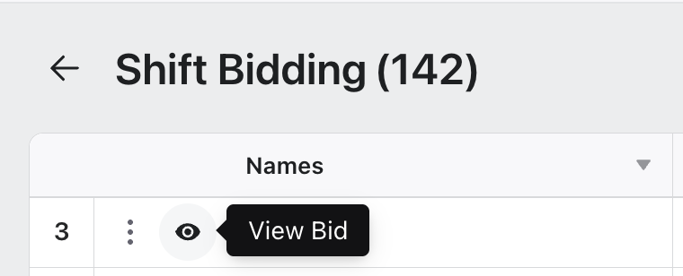

   ​
2. Click the View Bid (Eye icon) button corresponding to the Shift Bid to be viewed. This will open a detailed view of the Shift Bid.

Note: You can view Shift Bidding details only if the Shift Bid is not in Failed status.

This view is divided into two main sections: Pattern Overview and Agent Overview.

* Pattern Overview: Displays details of the shift patterns generated by the system, based on factors such as forecasted volume, average handle time (AHT), service level objectives, and assigned Schedule Policies.
* Agent Overview: Provides information about the agents participating in the Shift Bid.

## Pattern Overview

The Pattern Overview page displays the generated shift patterns for each day of the week, along with the user ratio and number of agents per patter. Participating agents can choose from the shift patterns shown in this section.

​

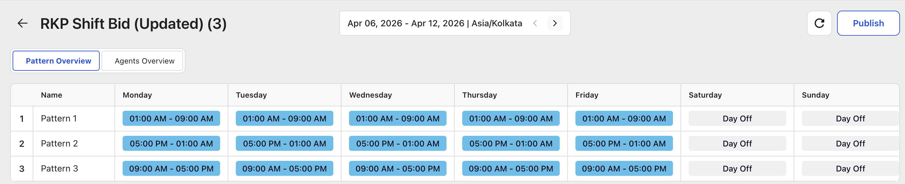​

​

You can change the week for which the shift patterns are displayed by using the Week selector at the top of the page.

## Agent Overview

The Agent Overview page provides a consolidated view of all agents participating in a Shift Bid. It helps supervisors track bidding progress, review assigned patterns, and monitor agent‑level details during the bidding window.

​

​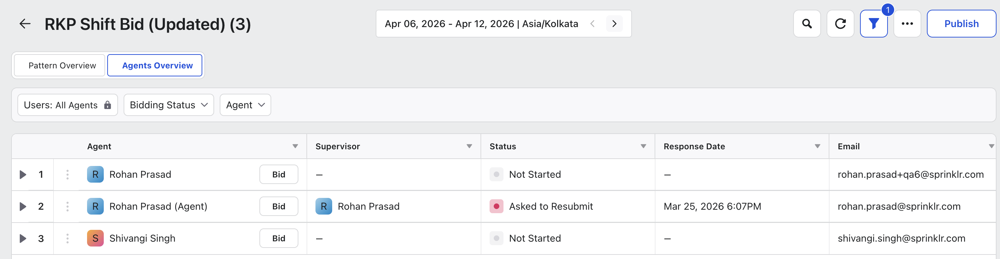

​

The toolbar at the top of the page includes the following options:

* Search: Search for a specific agent.
* Refresh: Reloads the page to display the most up‑to‑date details of the Shift Bid.
* Show/Hide Filter: Toggles the quick filters panel ON or OFF. Use this option to refine your results using predefined filters.
* Manage Columns: Opens the column customization panel, where you can choose which columns appear in the page and in which order. This allows you to tailor the view to show the most relevant information the Shift Bid.

### Available Columns

The following columns are available on the Agent Overview page:

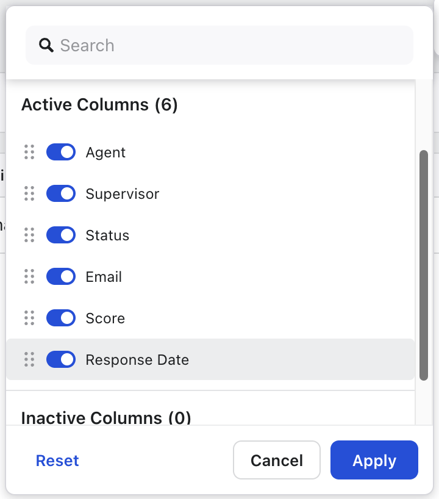

|  |  |
| --- | --- |
| Column Name | Description |
| Agent | Shows the agent’s name. |
| Supervisor | Displays the name of the supervisor assigned to the agent. |
| Status | Indicates the agent’s current bidding status, such as Not Started, Completed, Ask to Resubmit. |
| Email | Shows the agent’s registered email address. |
| Score | Displays the agent’s score used in Shift Bid ranking and prioritization.  Higher score indicates higher priority during shift assignment, based on the configured ranking method. |
| Response Date | Displays the date when the agent submitted their Shift Bid preference. |

​

### Shift Pattern Preview

Expanding an agent row displays the shift patterns the agent has bid on, along with a day‑by‑day preview of the associated shifts for the selected date range.

​

​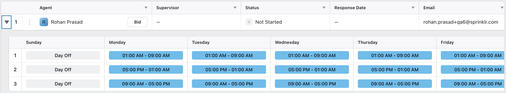

​

### Ask to Resubmit

You can return Shift Bid submissions to agents for resubmission. Sending a Shift Bid back allows you to request updates or corrections before final approval, ensuring that submitted preferences align with scheduling requirements and bidding policies.

Follow these steps to ask agents to resubmit Shift Bid preference:

1. View the Shift Bid details and switch to the Agents Overview section.

   ​

   ​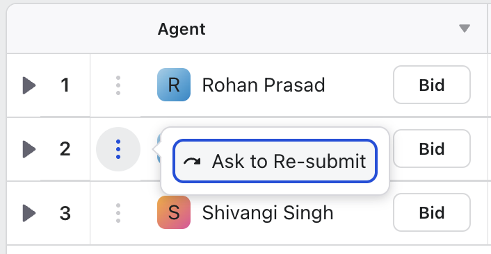

   ​
2. Click the More Actions (⋮) button corresponding to the agent and then select Ask to Re-Submit. The Resubmit Bid window opens.

   Note: The More Actions (⋮) button is accessible only when the agent has submitted the Shift Bid preferences.

   ​

   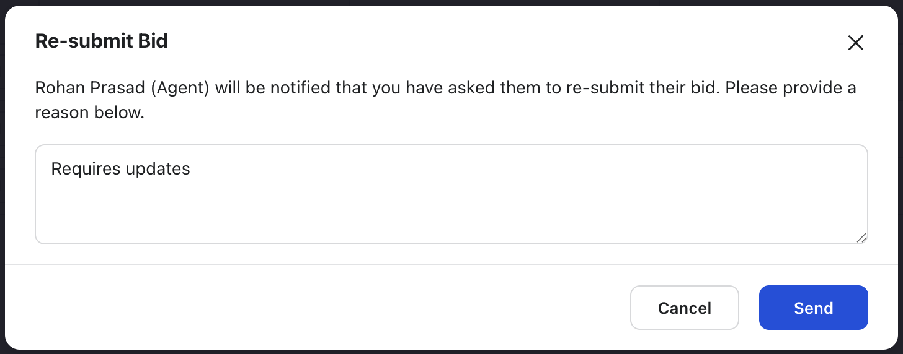

   ​
3. Enter the reason for requesting resubmission, and then select Send.

The agent receives a platform notification informing them that their shift bid has been returned for resubmission.

Publish/Unpublish Shift Bid​

Once you are satisfied with the Shift Bidding details, click the Publish in the upper‑right corner of the page to publish the shift bid. After publishing, agents can view the Shift Bid and submit their preferences within the configured bidding date range.

​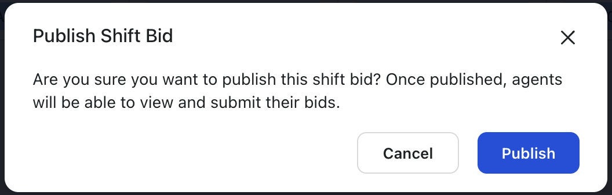

​

## Submit Shift Bid on Agent's Behalf

​Supervisors can submit Shift Bids on behalf of agents. This is helpful in situations where agents may not have system access due to network issues, technical problems, sudden emergencies, or when they are on vacation.

Follow these steps to submit Shift Bid on agent's behalf:

1. View the Shift Bid details and switch to the Agents Overview section.

   ​

   ​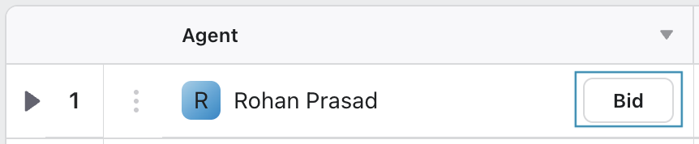

   ​
2. Click the Bid button corresponding to the agent for whom you want to submit Shift Bid preferences. The page opens with weekly shift patterns for all eligible weeks.

   ​

   ​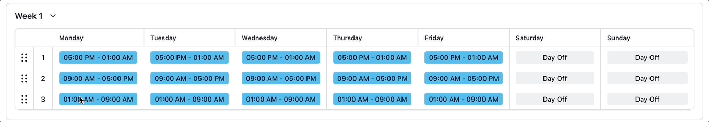

   ​
3. Rearrange the available Shift Patterns by selecting and holding the six‑dot handle next to each pattern.

   1. Each weekly pattern is numbered.
   2. A lower number indicates a higher priority.
4. Click Save after arranging the weekly shift patterns according to your preference.

​