# Manage Shifts in Sprinklr WFM

Shifts refer to the specific time periods during which agents are scheduled to work. They are strategically planned to ensure customer service operations run smoothly and continuously. This section outlines the essential steps for managing Shifts, including:

1. Creating Shifts
2. Editing Shifts
3. Cloning Shifts
4. Bulk Import Shifts
5. Sharing Shifts
6. Deleting Shifts.

# Create Shifts

Prerequisites for creating Shifts:

* Sprinklr WFM should be enabled for the environment.
* You must have access to the Workforce Manager Persona App.
* Create permission under the [Shift](https://www.sprinklr.com/help/articles/workforce-management-permissions/workforce-management-permissions/66866557bc79b41a23e4673d#d798e2b0-571a-4b86-8ef6-f141fdd06378 "https://www.sprinklr.com/help/articles/workforce-management-permissions/workforce-management-permissions/66866557bc79b41a23e4673d#d798e2b0-571a-4b86-8ef6-f141fdd06378") section in the Workforce Management module.

Scenario: A new campaign requires additional support during peak hours. The Administrator creates new Shifts to cover the increased traffic, ensuring adequate staffing during busy periods.

Follow these steps to create a Shift:

1. Go to the Workforce Manager Persona App on the Launchpad.

   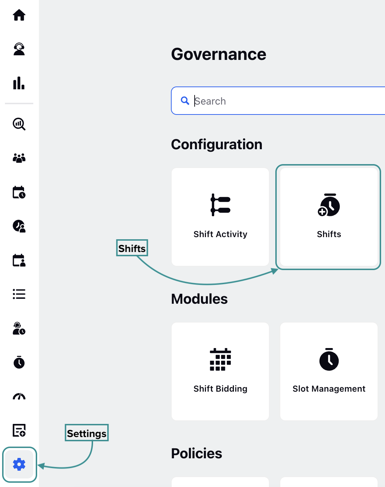
2. Select Settings from the Left Pane to open the Governance page.
3. Go to Shifts to open the Shifts Record Manager.

   ​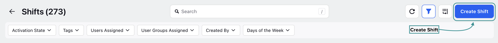
4. Click the Create Shift button at the top-right of the page to open the Create Shift page.
5. Fill in the required fields on the Create Shift page. Fields marked with a red star are mandatory. Below are the descriptions of the fields on this page:

   ​

   Note: The real-time, interactive Shift preview within the Shift creation form allows you to visually validate Shifts as they are configured. It instantly reflects changes to Shift properties such as start time, end time, duration, and Activities. As you add, modify, reorder, or remove Activities, the preview dynamically updates to show accurate timelines and Activity sequencing.

   ​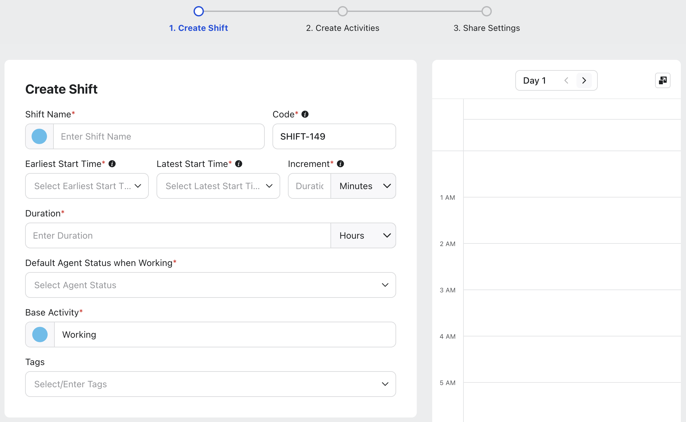

   ​

   1. Shift Name: Enter the name and color of the Shift. These will be used to display the Shift while viewing Schedule Scenarios and Master Schedule in Custom View. *(Required)*

      Note: The Shift color is set to the "#54BEEE" hexadecimal code by default. You can customize it by either selecting a color from the color picker or entering the hexadecimal code of the desired color.
   2. Code: This field will automatically generate a unique alphanumeric code for the Shift, such as SHIFT-69, for easy identification. However, you can also enter your own unique code if needed. *(Required)*
   3. Earliest Start Time: Enter the earliest time from which the Shift can start. *(Required)*
   4. Latest Start Time: Enter the latest time from which the Shift can start. *(Required)*
   5. Increment: Specify the time interval between the Earliest Start Time and the Latest Start Time at which the Shift can commence. *(Required)*

      Note: The time specified in the Latest Start Time cannot be less than the Earliest Start Time.

      This allows the Shift to have a flexible start time, with the interval defined by the difference between the Latest Start Time and the Earliest Start Time fields.

      For example, you have entered 9:00 AM in the Earliest Start Time field, 9:40 AM in the Latest Start Time field, and 10 Minutes in the Increment field. In this scenario, the Shift can start at 9:00 AM, 9:10 AM, 9:20 AM, 9:30 AM, or 9:40 AM.

      Note: The increment value must be a factor of the difference between the earliest and latest times. For example, if the difference is 30 minutes, valid options could be 2, 3, 5, 6, 10, 15, or 30 minutes.

      Note: If the Earliest Start Time and the Latest Start Time fields have the same value, the Shift can start only at the specified time, and hence, the Increment field will become inaccessible.
   6. Duration: Specify the duration of the Shift in hours or minutes. *(Required)*
   7. Default Agent Status when Working: Select the default statuses for agents during the shift from the available options. *(Required)*
   8. Base Activity: Enter the base activity and its associated color for the Shift. This will be shown on the Schedule Scenario landing page to represent the base activity when the Shift is assigned to agents. By default, it is set to "Working". *(Required)*

      Note: The Base Activity color will be used to display the Shift while viewing Schedule Scenarios and Master Schedule in Day View.
   9. Tags: Select the relevant tags from the Tags field.
6. Click the Next button to open the Create Activities page.
7. Fill in the required fields on the Create Activities page. Fields marked with a red star are mandatory:

   ​

   ​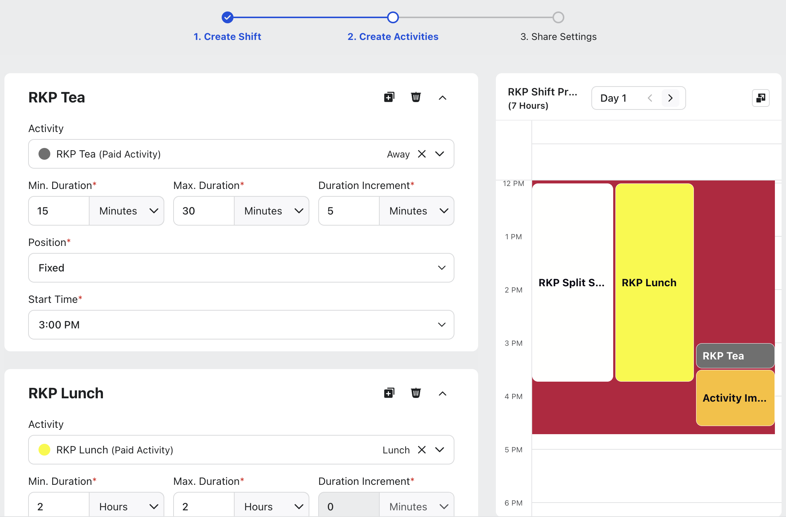

   ​

   1. Activity: Select the Activity from the list.
   2. Min. Duration: Enter the minimum duration for the Activity. You can use hours and minutes as units. *(Required)*
   3. Max. Duration: Enter the maximum duration for the Activity. You can use hours and minutes as units. *(Required)*
   4. Duration Increment: Specify the increments by which the Activity duration can vary within the interval between the Max. Duration and Min. Duration. *(Required)*
   5. Position: Choose when the Activity should be scheduled. *(Required)*

      The following options are available for selection in this field:

      1. Fixed: Starts the Activity only at the specified time.
      2. Automatic: Automatically assigns Activities based on staffing levels, the specified number of times the Activity should occur, and within the defined interval from the Shift start time.
      3. Relative to Shift Start: Automatically assigns Activities based on staffing levels and within the defined interval from the start of the Shift.
      4. Relative to Previous Activity: Schedules Activities relative to another Activity within the Shift.
   6. Based on your selection in the Position field, the relevant configuration steps will be displayed. Below are descriptions of the configuration steps for each available option.

      Fixed

      1. Start Time: Specify the time at which the Activity should start. *(Required)*

      Automatic

      1. Occurrence: Specify the number of times the Activity will be assigned within the interval. *(Required)*
      2. Earliest Start: Specify the minimum time after the Shift start time that the Activity can be assigned. *(Required)*
      3. Latest Start: Specify the maximum time after the Shift start time that the Activity can be assigned. *(Required)*
      4. Activity Start Increment: Enter the intervals after the Min. Length From Shift Start value at which the Activity can be assigned. *(Required)*

         Note: The increment value must be a factor of the difference between the earliest and latest times. For example, if the difference is 30 minutes, valid options could be 2, 3, 5, 6, 10, 15, or 30 minutes.

         Working Example: Consider you have a Shift named Shift-69 that starts at 9:00 AM and ends at 5:00 PM. You have entered ‘2’ in the Occurrence field, ‘4 hours’ in the Min. Length From Shift Start field, ‘6 hours’ in the Max. Length From Shift Start field, and ‘30 minutes’ in the Activity Start Increment field. This means the Activity will be assigned twice during the Shift. It can be assigned between 1:00 PM and 3:00 PM and can be assigned at either 1:00 PM, 1:30 PM, 2:00 PM, 2:30 PM, or 3:00 PM.

      Relative to Shift Start

      1. Earliest Start: Specify the minimum time after the Shift start time that the Activity can be assigned. *(Required)*
      2. Latest Start: Specify the maximum time after the Shift start time that the Activity can be assigned. *(Required)*
      3. Activity Start Increment: Enter the intervals after the Min. Length From Shift Start value at which the Activity can be assigned. *(Required)*

         Note: The increment value must be a factor of the difference between the earliest and latest times. For example, if the difference is 30 minutes, valid options could be 2, 3, 5, 6, 10, 15, or 30 minutes.

      Relative to Previous Activity

      1. Previous Activity: Choose the Activity relative to which this Activity should begin. *(Required)*

         Note: Activities already scheduled for the Shift will appear in the list. If no other Activities are scheduled, the list will be empty.
      2. Earliest End: Specify the minimum time gap required after the end of the previous Activity before this Activity can be scheduled. *(Required)*
      3. Latest End: Specify the maximum time gap required after the end of the previous Activity before this Activity must be scheduled. *(Required)*
      4. Activity Start Increment: Enter the intervals after the Min. Length From Activity Time value at which the Activity can be assigned. *(Required)*
   7. Click the +Add Activity button to add and configure more Activities to the Shift.

      Activities appear in the preview as you configure their position and start and end times. The system updates the Shift preview in real time, allowing you to see how the Activities will appear in the Shift as you add them.

      Note: You can also clone already configured Activities to quickly create another Activity with the same details.

      ​
8. Click the Next button to open the Share Settings page.
9. Fill in the required fields on the Share Settings page. Fields marked with a red star are mandatory:

   ​

   ​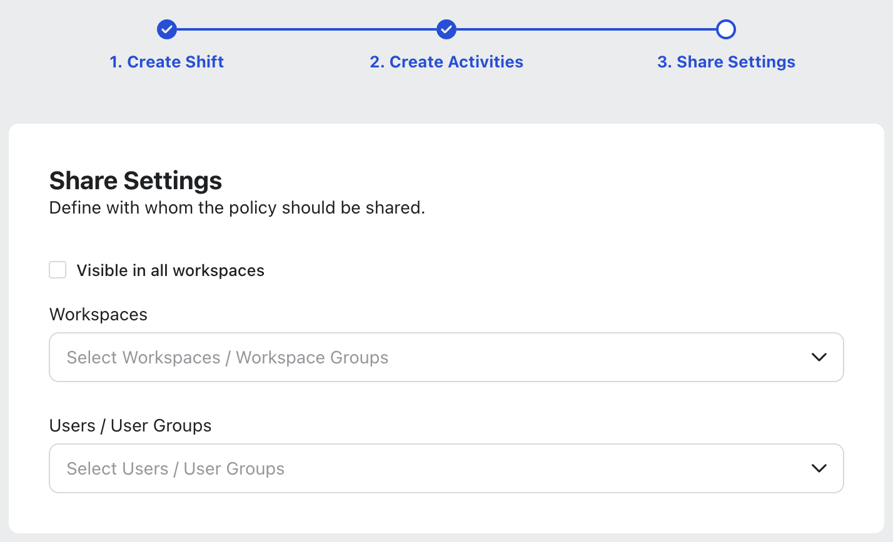

   ​

   1. Visible in all workspaces: Select this checkbox if you want to share the Shift with all Users/User Groups in all available Workspaces.
   2. Workspaces: Select the Workspaces that you want to share this Shift with. *This field will be accessible only if the* *Visible in all workspaces* *checkbox is not selected.*
   3. User/User Groups: Select the User(s)/User Group(s) you want to share the Shift with. *This field will be accessible only if the* *Visible in all workspaces* *checkbox is not selected.*
10. Click the Create button to create the Shift with the entered configurations.

This completes the process of creating a Shift and configuring the required Activities.

## Create Split Shifts

You can create Split Shifts, that is, Shifts that have non-working, unpaid intervals in between. These periods are excluded from Shift duration, Adherence, Staffing Metrics, and Reporting. To create Split Shifts, follow the same steps as creating a regular Shift. For any interval you want to mark as non-working and unpaid, assign an [Activity](https://www.sprinklr.com/help/articles/manage-activities/manage-activities-in-sprinklr-wfm/67b6e75905f0a008a9a0737e#8c6c1366-a024-468b-89ca-d2b27da10495 "https://www.sprinklr.com/help/articles/manage-activities/manage-activities-in-sprinklr-wfm/67b6e75905f0a008a9a0737e#8c6c1366-a024-468b-89ca-d2b27da10495") that belongs to the Pseudo/Not Working Activity Impact.

## Shift Preview

The real-time, interactive Shift preview within the Shift creation form allows you to visually validate Shifts as they are configured. It instantly reflects changes to Shift properties such as start time, end time, duration, and Activities. As you add, modify, reorder, or remove Activities, the preview dynamically updates to show accurate timelines and Activity sequencing.

---

# Edit Shifts

Prerequisites for editing Shifts:

* Sprinklr WFM should be enabled for the environment.
* You must have access to the Workforce Manager Persona App.
* Edit permission under the [Shift](https://www.sprinklr.com/help/articles/workforce-management-permissions/workforce-management-permissions/66866557bc79b41a23e4673d#d798e2b0-571a-4b86-8ef6-f141fdd06378 "https://www.sprinklr.com/help/articles/workforce-management-permissions/workforce-management-permissions/66866557bc79b41a23e4673d#d798e2b0-571a-4b86-8ef6-f141fdd06378") section in the Workforce Management module.

Scenario: Agents request a change in their Shift. The Administrator edits the Shift to accommodate their request, maintaining overall coverage and agent satisfaction.

Follow these steps to edit a Shift:​

1. Go to the Workforce Manager Persona App on the Launchpad.

   ​
2. Select Settings from the Left Pane to open the Governance page.
3. Go to Shifts to open the Shifts Record Manager.
4. Hover over the vertical ellipsis (⋮) icon corresponding to the Shift you want to edit. This will show a list of options.

   ​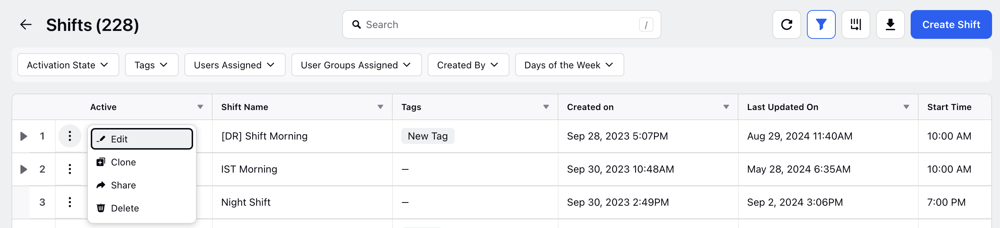
5. Select Edit from the list of options to open the Edit Shift page.
6. Update the necessary details for the selected Shift. The fields are the same as those used when creating a Shift.
7. After entering the updated details, click the Update button at the bottom right of the Edit Activities page to save the Shift with new details.

This completes the process of editing a Shift.

---

# Clone Shifts

Prerequisites for cloning Shifts:

* Sprinklr WFM should be enabled for the environment.
* You must have access to the Workforce Manager Persona App.
* Edit permission under the [Shift](https://www.sprinklr.com/help/articles/workforce-management-permissions/workforce-management-permissions/66866557bc79b41a23e4673d#d798e2b0-571a-4b86-8ef6-f141fdd06378 "https://www.sprinklr.com/help/articles/workforce-management-permissions/workforce-management-permissions/66866557bc79b41a23e4673d#d798e2b0-571a-4b86-8ef6-f141fdd06378") section in the Workforce Management module.

Scenario: A successful Shift pattern needs to be replicated for later use. The Administrator clones the existing Shift, making minor adjustments as needed to streamline the scheduling process and maintain consistency.

Follow these steps to clone a Shift:​

1. Go to the Workforce Manager Persona App on the Launchpad.

   ​
2. Select Settings from the Left Pane to open the Governance page.
3. Go to Shifts to open the Shifts Record Manager.

   ​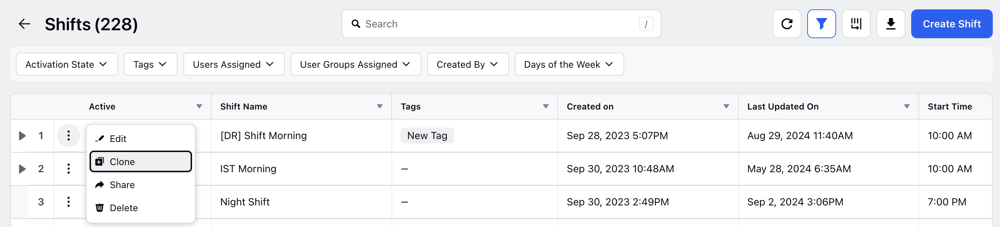
4. Hover over the vertical ellipsis (⋮) icon corresponding to the Shift you want to clone. This will show a list of options.
5. Select Clone from the list of options to open the Clone Shift dialog box.

   ​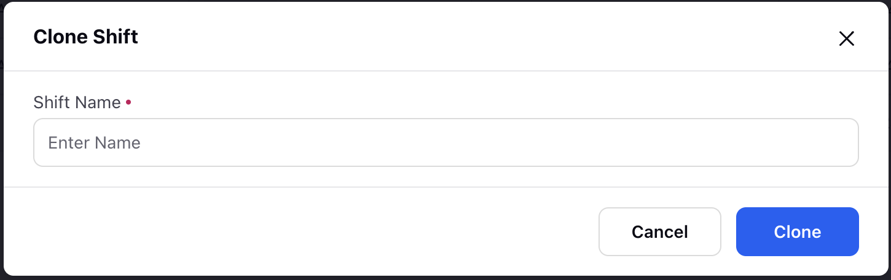
6. In the Shift Name field, enter the name by which the cloned Shift will be called.
7. Click the Clone button at the bottom right of the dialog box to create a cloned version of the Shift.

This completes the process of cloning a Shift.

---

# Bulk Import Shifts

Follow these steps to bulk import Shifts:

1. [Navigate](#89e61e11-8809-4d97-a234-b71576485046 "#89e61e11-8809-4d97-a234-b71576485046") to Shifts Record Manager.

   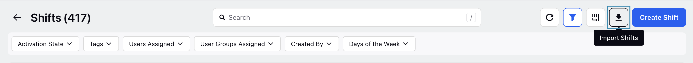
2. Click the Import Shifts button at the top right of the page to open the Import Shifts window.

   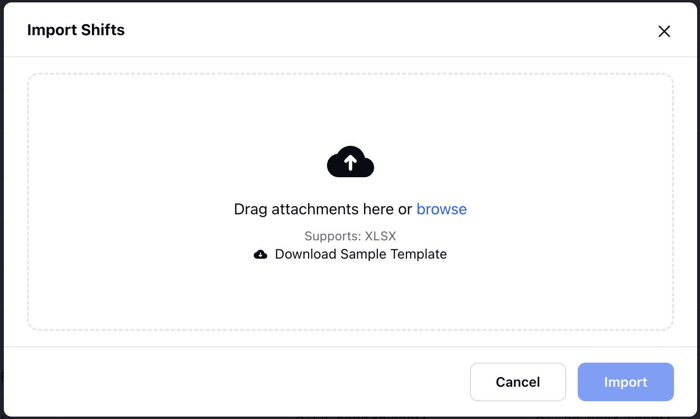
3. Upload the template file with details of the Shifts and Activities. *The template file must be in .xlsx format.*
4. Once the file is successfully uploaded, click the Import button.

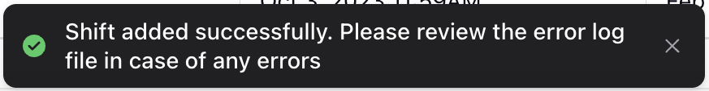

After clicking the Import button, it will take some time to complete the import process. You will receive a toast notification if the import was successfully completed.

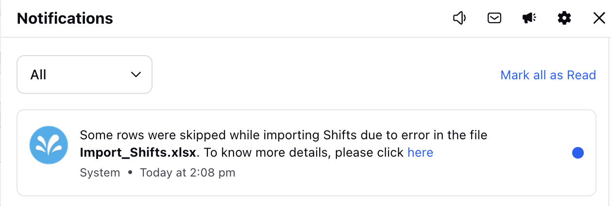

You will receive a system notification if the import cannot be completed due to an error in the file. The notification will include a link. Clicking the link will open a file that displays the errors in the uploaded template.

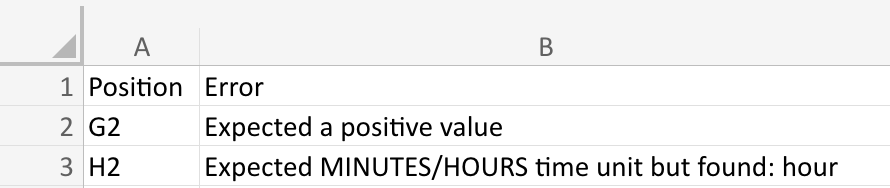

The Position column in the file will show the cell numbers where errors were detected, and the corresponding cells in the Error column will contain the error descriptions.

## Shifts Import File Specifications

* XLSX is the approved file format.
* The template file to bulk import Shifts is divided into two tab, Shifts Information and Activities Information. Details related to Shifts, such as Shift Name and Earliest/Latest Start Times, will be added in the Shifts Information tab. Details related to Activities during the Shifts will be added in the Activities Information tab.

The following headers are mandatory in the file (Do not modify the headers, including their case):

Shifts Information

Activities Information

|  |  |  |
| --- | --- | --- |
| Parameter | Header | Remarks |
| Serial Number | serialNumber | Mandatory field. |
| Shift Name | shiftName | Mandatory field. |
| Shift Code | shiftCode | Must be alphanumeric. If not provided, Shift Code will be auto generated. Optional field. |
| Earliest Start Time | earliestStartTime | Specify in hh:mm AM/PM format. (For example, 09:15 AM or 12:30 PM). Mandatory field. |
| Latest Start Time | latestStartTime | Specify in hh:mm AM/PM format. (For example, 09:15 AM or 12:30 PM). Mandatory field. |
| Increment | increment | The time interval between the Earliest Start Time and the Latest Start Time at which the Shift can start. It must be a factor of difference between earliest and latest times. Mandatory field. |
| Increment Unit | incrementUnit | Specify the unit of Increment (minutes or hours). Mandatory field. |
| Duration | duration | Specify the duration of the Shift. Mandatory field. |
| Duration Unit | durationUnit | Specify the unit of Duration (minutes or hours). Mandatory field. |
| Default Agent Status | defaultAgentStatuses | Mandatory field. |
| Base Activity | baseActivity | Mandatory field. |
| Shift Color | shiftColor | Enter the hexadecimal code of the Shift color. (For example, #54BEEE). Optional field. |
| Tags | tags | Optional text field. Optional field. |
| Visible in All Workspaces | visibleInAllWorkspaces | True or False. Optional field. |
| Shared Workspaces | sharedWorkspaces | Optional field. |
| Shared Workspace Groups | sharedWorkspaceGroups | Optional field. |
| Shared Users | sharedUsers | Optional field. |
| Shared User Groups | sharedUserGroups | Optional field. |

|  |  |  |
| --- | --- | --- |
| Parameter | Header | Remarks |
| Serial Number | serialNumber | Must match the Serial Number of the Shift to which the Activity is to be mapped, as specified in the Shift Information tab.  For example, if the Activity needs to be mapped to the Shift with serial number '8' in the Shift Information tab, the Serial Number for this Activity must also be '8'. Optional field; required only if Activity is being provided. |
| Activity Number | activityNumber | Optional field; required only if Activity is being provided. |
| Activity Code | activityCode | Optional field; required only if Activity is being provided. |
| Activity Name | activity | Optional field; required only if Activity is being provided. |
| Minimum Duration | minDuration | Positive integer field. |
| Minimum Duration Unit | minDurationUnit | Specify the unit of Minimum Duration. (Hours or Minutes) |
| Maximum Duration | maxDuration | Positive integer field. Optional field; required only if Activity is being provided. |
| Maximum Duration Unit | maxDurationUnit | Specify the unit of Maximum Duration. (Hours or Minutes). Optional field; required only if Activity is being provided. |
| Duration Increment | durationIncrement | Positive integer field. Optional field; required only if Activity is being provided. |
| Duration Increment Unit | durationIncrementUnit | Specify the unit of Duration Increment. (Hours or Minutes). Optional field; required only if Activity is being provided. |
| Activity Positioning Type | timingType | Fixed, Automatic, Relative to Shift Start, or Relative to Previous Activity. Optional field; required only if Activity is being provided. |
| Occurrence | occurrence | Positive integer field. Optional field; required only if Activity is provided and Automatic is selected in timingType. |
| Start Time Fixed | startTimeFixed | Specify in hh:mm AM/PM format. (For example, 09:15 AM or 12:30 PM). Optional field; required only if Activity is provided and Fixed is selected in timingType. |
| Minimum Duration from Start Time | minDurationFromStartRelative | Positive integer field. Optional field; required only if Activity is provided and Relative to Shift Start is selected in timingType. |
| Minimum Duration from Start Time Unit | minDurationFromStartUnit | Specify the unit of Minimum Duration from Start Time. (Hours or Minutes). Optional field; required only if Activity is provided and Relative to Shift Start is selected in timingType. |
| Maximum Duration from Start Time | maxDurationFromStartRelative | Positive integer field. Optional field; required only if Activity is provided and Relative to Shift Start is selected in timingType. |
| Maximum Duration from Start Time Unit | maxDurationFromStartUnit | Specify the unit of Maximum Duration from Start Time. (Hours or Minutes). Optional field; required only if Activity is provided and Relative to Shift Start is selected in timingType. |
| Minimum Duration from Previous Activity End | minDurationFromPreviousActivityEnd | Optional field; required only if Activity is provided and Relative to Previous Activity is selected in timingType. |
| Minimum Duration from Previous Activity End Unit | minDurationFromPreviousActivityEndUnit | Optional field; required only if Activity is provided and Relative to Previous Activity is selected in timingType. |
| Maximum Duration from Previous Activity End | maxDurationFromPreviousActivityEnd | Optional field; required only if Activity is provided and Relative to Previous Activity is selected in timingType. |
| Maximum Duration from Previous Activity End Unit | maxDurationFromPreviousActivityEndUnit | Optional field; required only if Activity is provided and Relative to Previous Activity is selected in timingType. |
| Relative Activity Number | relativeActivityNumber | Optional field; required only if Activity is provided and Relative to Previous Activity is selected in timingType. |
| Activity Start Increment | activityStartIncrement | Optional field; required only if Activity is provided and Automatic, Relative to Previous Activity, or Relative to Shift Start is selected in timingType. |
| Activity Start Increment Unit | activityStartIncrementUnit | Optional field; required only if Activity is provided and Automatic, Relative to Previous Activity, or Relative to Shift Start is selected in timingType. |

This completes the process of bulk importing Shifts.

---

# Share Shifts

Prerequisites for sharing Shifts:

* Sprinklr WFM should be enabled for the environment.
* You must have access to the Workforce Manager Persona App.
* Share permission under the [Shift](https://www.sprinklr.com/help/articles/workforce-management-permissions/workforce-management-permissions/66866557bc79b41a23e4673d#d798e2b0-571a-4b86-8ef6-f141fdd06378 "https://www.sprinklr.com/help/articles/workforce-management-permissions/workforce-management-permissions/66866557bc79b41a23e4673d#d798e2b0-571a-4b86-8ef6-f141fdd06378") section in the Workforce Management module.

Scenario: The weekly schedule needs to be communicated to all agents. The Administrator shares the finalized Shift schedule with the team, ensuring everyone is informed of their assigned Shifts.

Follow these steps to share a Shift:​

1. Go to the Workforce Manager Persona App on the Launchpad.

   ​
2. Select Settings from the Left Pane to open the Governance page.
3. Go to Shifts to open the Shifts Record Manager.
4. Hover over the vertical ellipsis (⋮) icon corresponding to the Shift you want to share. This will show a list of options.

   ​
5. Select Edit from the list of options to open the Edit Shift page.
6. Scroll down to the Share Settings section, where you can select the User/User Group(s) with whom the Shift has to be shared.

   ​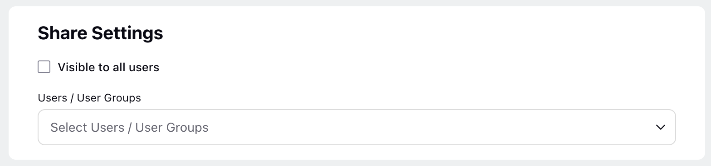

   1. Visible to all users: Select this checkbox if you want to share the Shift with all available Users.
   2. Users/User Groups: Select the User(s)/User Group(s) you want to share the Shift with. *This field will be accessible only if the Visible to all users checkbox is not selected.*
7. Click the Next button at the bottom right of the page to open the Edit Activities page.
8. Click the Update button at the bottom right of the Edit Activities to save your share settings.

This completes the process of sharing a Shift.

---

# Delete Shifts

Prerequisites for sharing Shifts:

* Sprinklr WFM should be enabled for the environment.
* You must have access to the Workforce Manager Persona App.
* Delete permission under the [Shift](https://www.sprinklr.com/help/articles/workforce-management-permissions/workforce-management-permissions/66866557bc79b41a23e4673d#d798e2b0-571a-4b86-8ef6-f141fdd06378 "https://www.sprinklr.com/help/articles/workforce-management-permissions/workforce-management-permissions/66866557bc79b41a23e4673d#d798e2b0-571a-4b86-8ef6-f141fdd06378") section in the Workforce Management module.

Scenario: A planned Shift is no longer needed due to a change in campaign strategy. The Administrator deletes the unnecessary Shift from the schedule, preventing overstaffing and optimizing resource allocation.

Follow these steps to delete a Shift:

​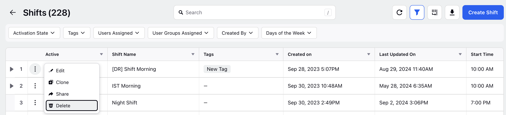

1. Go to the Workforce Manager Persona App on the Launchpad.
2. Select Settings from the Left Pane to open the Governance page.
3. Go to Shifts to open the Shifts Record Manager.
4. Hover over the vertical ellipsis (⋮) icon corresponding to the Shift you want to delete. This will show a list of options.
5. Select Delete from the list of options to open the Delete Shift Config dialog box.

   ​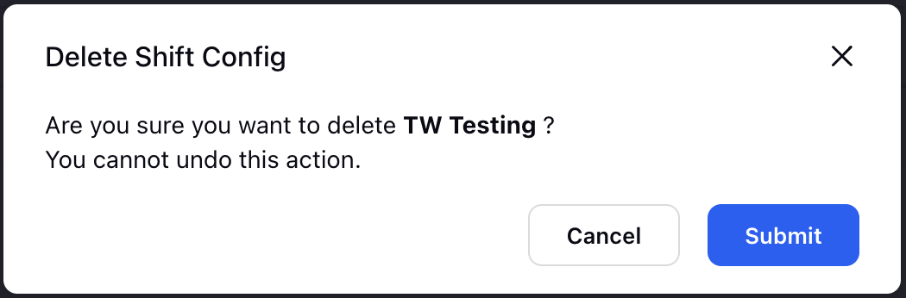
6. Click the Submit button to delete the Shift. *This action cannot be undone.*

---

# Audit Trail for Shifts

The Audit Trail feature allows you to track all changes within the Shifts. It logs every activity, from minor updates to major changes, complete with date and time stamps along with details of the user who has made changes for full transparency and traceability.

Prerequisites for Audit Trail Support: 

* Sprinklr WFM should be enabled for the environment.
* You must have access to the Workforce Manager Persona App and Shifts.

Follow these steps to access Audit Trail for Shifts:

1. Go to the Workforce Manager Persona App on the Launchpad.
2. Go to Settings.
3. Select Shifts.

   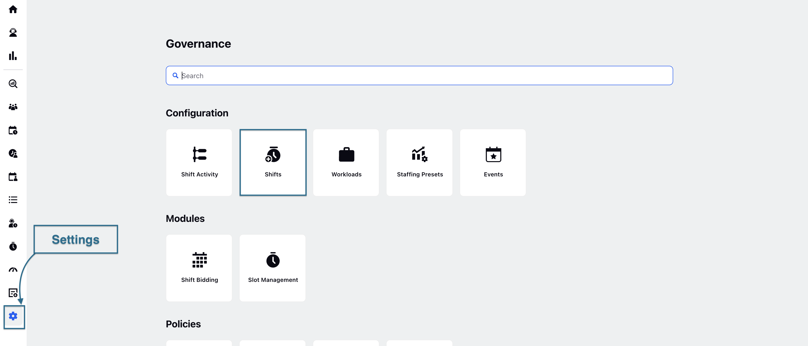
4. Hover over the vertical ellipsis (⋮) icon corresponding to the Shift for which you want to view the Audit Trail.
5. Click View Audit Logs.

   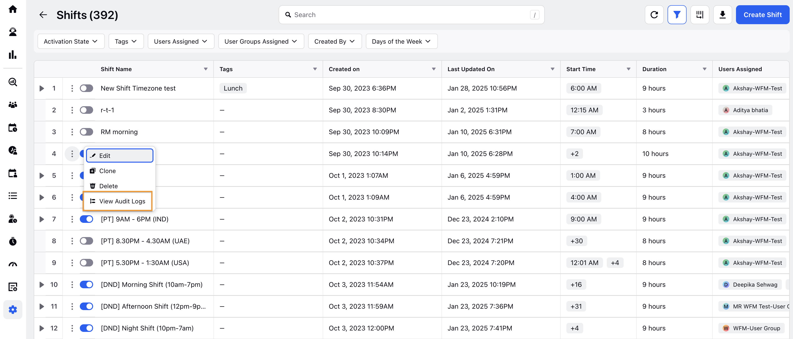

   The Audit logs will appear in the right pane.

Manage Audit Log

* Refresh: Click Refresh option to refresh the log.

* Sort: Allows you to sort the log in descending or ascending order.

* Copy URL: Copy URL option helps to copy the page URL.

---