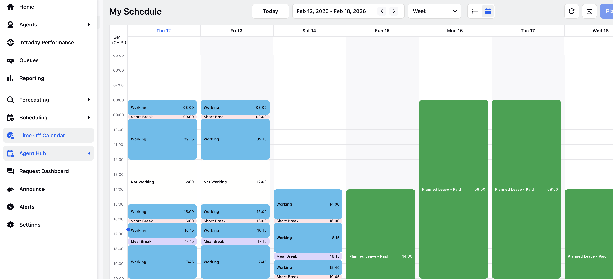

# Standard Workforce Manager Persona App

The Workforce Manager Persona App is designed to support Administrators and Workforce Managers in managing day-to-day workforce planning and operational tasks. It provides a centralized workspace for accessing the tools, reports, and workflows needed to efficiently configure and run workforce operations.

Note: You can rename this app to align with your organization’s terminology by using the [Persona App Manager](https://www.sprinklr.com/help/articles/other-configurations/configure-persona-apps-for-workforce-management/66866b54bc79b41a23e46adb#_c82eb946-2431-4bb2-b3f5-554b2aa38bca "https://www.sprinklr.com/help/articles/other-configurations/configure-persona-apps-for-workforce-management/66866b54bc79b41a23e46adb#_c82eb946-2431-4bb2-b3f5-554b2aa38bca").

Although Sprinklr supports extensive customization, this document focuses on the standard configuration of the Workforce Manager Persona App and serves as a baseline reference. It helps you understand the default structure and capabilities of the standard Workforce Manager Persona App, including the tools, dashboards, and workflows available to Workforce Managers out of the box, before you make any changes or customizations.

Refer to [this page](https://www.sprinklr.com/help/articles/other-configurations/configure-persona-apps-for-workforce-management/66866b54bc79b41a23e46adb "https://www.sprinklr.com/help/articles/other-configurations/configure-persona-apps-for-workforce-management/66866b54bc79b41a23e46adb") to customize or create new Persona Apps for Workforce Management.

This document describes the default structure, components, and behavior of the standard Workforce Manager Persona App. It explains how the app is organized and the capabilities available out of the box. Where applicable, it also identifies configuration points that you can tailor to meet specific business requirements.

Use this document to:

* Understand the standard Workforce Manager Persona App setup.
* Validate your current configuration against the standard baseline.

# Left Pane

The Left Pane serves as the primary navigation area in the Workforce Manager Persona App. From the Left Pane, you can navigate to each core Workforce Management functionality, making it the central starting point for all workflows. It provides quick and consistent access to features such as forecasting, scheduling, agent management, and other administrative tools, allowing you to move efficiently between different areas of the application without losing context.

The following options are available in the standard Workforce Manager Persona App in the Left Pane:

|  |  |  |
| --- | --- | --- |
| Menu | Sub-Menu | Description |
| Home | None | Serves as the default home page for Workforce Managers to manage and monitor team activities. It can be customized to display relevant information that provides a comprehensive view of key performance metrics, enabling managers to quickly assess agent performance and overall team performance. |
| Agents | Real Time Adherence | Opens the [Real Time Adherence dashboard](https://www.sprinklr.com/help/articles/real-time-adherence/real-time-adherence-dashboard/68d419c2c8792738a63e81c7 "https://www.sprinklr.com/help/articles/real-time-adherence/real-time-adherence-dashboard/68d419c2c8792738a63e81c7"), which provides real-time visibility into agent adherence, schedule deviations, current status, and related details. From this dashboard, you can also assign policies, such as Time Off and Schedule policies, to agents and request Time Off on an agent’s behalf. |
| Agent Management | Opens the [Agent Management dashboard](https://www.sprinklr.com/help/articles/real-time-adherence/agent-management-dashboard/67b6fee0b11591396c32c317 "https://www.sprinklr.com/help/articles/real-time-adherence/agent-management-dashboard/67b6fee0b11591396c32c317"), which provides a centralized view of agent user properties, including assigned policies, policy durations (if applicable), and all agent-level Custom Fields. From this dashboard, you can view and edit Custom Fields and assign policies, enabling efficient review and management of agent information for workforce planning and scheduling. |
| Intra Day Performance | None | Opens the Intraday Performance Record Manager, through which you can access the [Reforecasting](https://www.sprinklr.com/help/articles/forecast-scenarios/reforecasting/68cd15ead65a5d6e7e0b3dfd "https://www.sprinklr.com/help/articles/forecast-scenarios/reforecasting/68cd15ead65a5d6e7e0b3dfd") functionality. Reforecasting recalculates the intraday parameters such as volume, average handle time (AHT), and service level. It refines intraday predictions by combining the generated forecast data and actual contact volume trends. |
| Queue | None | Allows managers to view and manage Queue-level information, including workload distribution, staffing levels, and performance metrics. [Queue Monitoring](https://www.sprinklr.com/help/categories/queue-monitoring/64be8d4a967af226ddfbfe9a "https://www.sprinklr.com/help/categories/queue-monitoring/64be8d4a967af226ddfbfe9a") provides a real-time, high-level view of all Queues, with the ability to drill down into individual Queues to analyze key metrics such as SLA, customers waiting, average wait time, and abandonment rate. |
| Reporting | None | Opens the page that lists all Reporting Dashboards shared with the Workforce Manager Persona App. From this page, you can access Dashboards that provide insights into workforce performance, trends, and operational metrics, enabling data-driven monitoring and decision-making. |
| Forecast | Forecast Scenario | Opens the Forecast Scenario Record Manager, which lists all available [Forecast Scenarios](https://www.sprinklr.com/help/categories/forecast-scenarios/69c40d880a6ad658415efede "https://www.sprinklr.com/help/categories/forecast-scenarios/69c40d880a6ad658415efede") with key overview details. From this page, you can manage existing scenarios, create new ones, and perform additional actions such as What‑If Analysis and Split Profile management. |
| Master Forecast | Opens the [Master Forecast](https://www.sprinklr.com/help/articles/forecast-scenarios/manage-master-forecast/6717ccb91788a8794fe2ab58 "https://www.sprinklr.com/help/articles/forecast-scenarios/manage-master-forecast/6717ccb91788a8794fe2ab58"), which provides an overview of published Forecast Scenarios and their associated staffing. From the Master Forecast, you can access detailed forecast data, such as date, day, interval, and volume, to accurately assess contact center staffing requirements. |
| Scheduling | Schedule Scenario | Opens the Schedules Record Manager, which lists of [Schedule Scenarios](https://www.sprinklr.com/help/categories/schedule-scenarios/679b887688b1ff3481fce119 "https://www.sprinklr.com/help/categories/schedule-scenarios/679b887688b1ff3481fce119") with key overview details. From this page, you can manage existing scenarios, create new ones, and perform additional actions such as Schedule Scenario optimization, and more. |
| Master Schedule | Opens the [Master Schedule](https://www.sprinklr.com/help/categories/master-schedule/68f097df91813c6c5d807a95 "https://www.sprinklr.com/help/categories/master-schedule/68f097df91813c6c5d807a95"), which provides a comprehensive overview of all agents' schedules. This holistic view facilitates tracking Shift Trades, Time Offs, Adherence, agent's schedule audit, and more. |
| Time Off Calendar | None | Opens the Supervisor Time Off Calendar, which provides a centralized view of agent availability. From this page, you can view, track, and [manage Time Off requests](https://www.sprinklr.com/help/articles/time-off-management/manage-time-off-requests/68654f8020753412ba1d4dad "https://www.sprinklr.com/help/articles/time-off-management/manage-time-off-requests/68654f8020753412ba1d4dad") for all agents. |
| Agent Hub | My Schedule | Opens the [My Schedule page](https://www.sprinklr.com/help/articles/manage-schedule/agent-schedule-management/6686675b614893335bb32770 "https://www.sprinklr.com/help/articles/manage-schedule/agent-schedule-management/6686675b614893335bb32770"), which shows a detailed view of the user’s upcoming and previous schedule. It helps users stay updated on Shifts or Time Off changes, reducing the risk of missed shifts or scheduling conflicts. |
| My Preferences | Opens the My Schedule Preferences page, that allows users to [submit their preferred Shifts](https://www.sprinklr.com/help/articles/manage-schedule/submit-agent-preferences/68652cab1748194861b921b9 "https://www.sprinklr.com/help/articles/manage-schedule/submit-agent-preferences/68652cab1748194861b921b9") before Schedule Scenarios are created. These preferences are taken into account during the scheduling process. |
| Slot Calendar | Opens the Slot Calendar, which allows users to view available Slots in a calendar view. From this page, users can submit [Slot requests](https://www.sprinklr.com/help/articles/create-slot-requests/create-slot-requests/68244810cffeb5201cea6c1d "https://www.sprinklr.com/help/articles/create-slot-requests/create-slot-requests/68244810cffeb5201cea6c1d") directly. |
| My Requests | Opens the My Requests dashboard, which allows users to view the status of current and past requests, such as Time Off or Shift Change requests. From this page, users can also create new Time Off, Shift Change, and Shift Trade requests. |
| Request Dashboard | None | Opens the Request Dashboard, which provides Workforce Managers with centralized access to requests, such as Time Off and Shift Change requests, that are pending review or have already been reviewed. |
| Announce | None | Open the Announcements Record Manager, that allows Administrators and Workforce Managers to create [Announcements](https://www.sprinklr.com/help/categories/announcements/63e4b8861de6844f81af143f "https://www.sprinklr.com/help/categories/announcements/63e4b8861de6844f81af143f") for specific agents or agent groups. These Announcements are displayed to agents when they log in to Sprinklr, ensuring timely communication of important updates, or operational messages. |
| Alert | None | Opens the Alerts Record Manager, which allows Administrators and Workforce Managers to create and manage [Alerts](https://www.sprinklr.com/help/categories/alerts-monitoring/63e4b8661de6844f81af0b68 "https://www.sprinklr.com/help/categories/alerts-monitoring/63e4b8661de6844f81af0b68"). Alerts help identify situations that require immediate attention by notifying users in real time so they can take timely and appropriate action. |
| Settings | None | Opens the Governance page, that allows Workforce Managers to create various Workforce Management-related entities such as Shifts, Activities, Work Types, Shift Patterns, Policies, and more. |